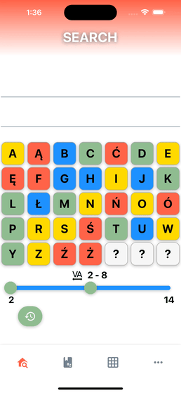
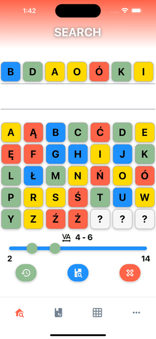
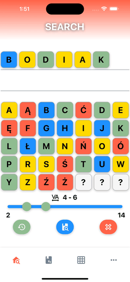
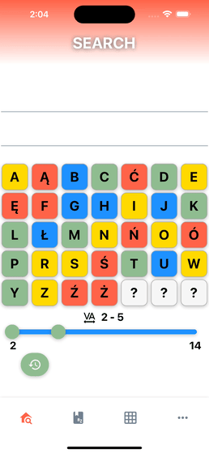

#### 🔠 Make your Scrabble matches a little bit more easy with this simple mobile app for android and iOS! 

  

# Wyrazowo - mobile App
1. [How Wyrazowo can help me?](#how-wyrazowo-can-help-me?)
2. [Technical](#technical)
3. [How to use Wyrazowo App?](#how-to-use-wyrazowo-app?)

## How Wyrazowo can help me?
#### Wyrazowo gives you several tools to help you better validate scrabble games. You can verify the correctness of the words or search the database for suitable letters combinations. You will also find some simple games which can help you to expand your scrabble knowledge.

## Technical
### Tech Stack:
- React Native 71
- Typescript 4
- Kotlin 1.8
- Swift 5
- Styled Components 5
- React Native Reanimated 3
- Ramda

## How to use Wyrazowo App?
### How to find possible words from given letters?

Select your all letters from grid by tapping them.
Then use blue search button to see all possible words from given letters.
Results are sorted by word length and points value.

You can deselect specific letters by tapping them or clear all selected letters by tapping red clear button.

By long press on any word from results you can see word details including points value and definitions from sjp dictionary.

You can also use long press on any selected letter to determine its position in word.

Search engine supports soap letters which can be used as placeholder for any letter.
You can also configure your soap letter by long press on it and selecting any letters.

From green button you can access your search history.
Tap any element from history to see results.

