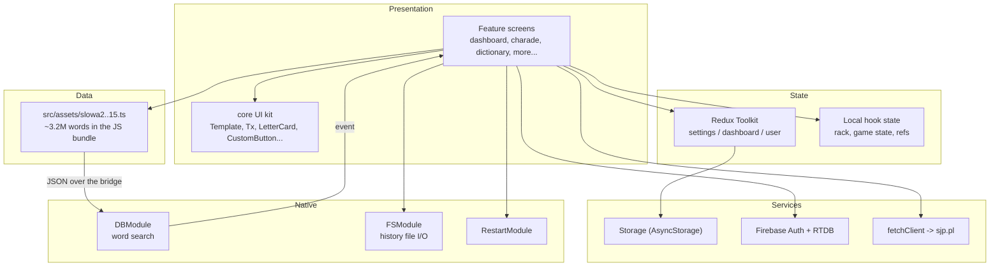
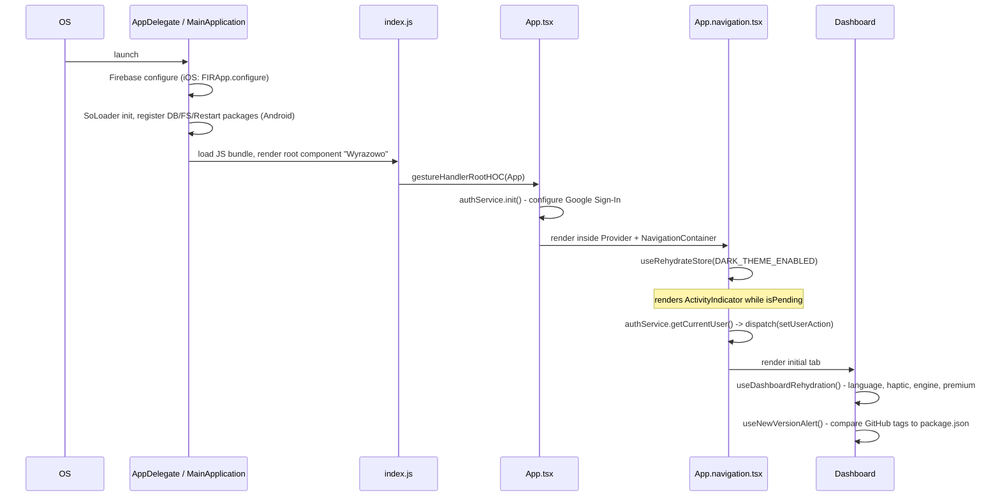
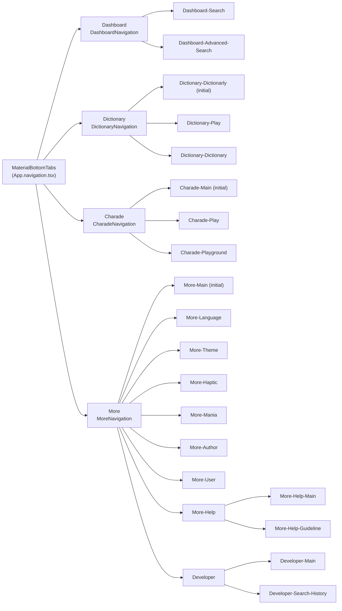

# 01 — Architecture

High-level structure of the app: how it boots, how screens are organised, how state flows.

- [Layer overview](#layer-overview)
- [App boot sequence](#app-boot-sequence)
- [Provider tree](#provider-tree)
- [Navigation tree](#navigation-tree)
- [Redux store](#redux-store)
- [Settings rehydration](#settings-rehydration)
- [Theme resolution](#theme-resolution)
- [Module anatomy](#module-anatomy)
- [Cross-cutting dependencies](#cross-cutting-dependencies)

---

## Layer overview



The important structural fact: **the word data lives in the JavaScript bundle, not in the native
layer**. Native modules are stateless workers that receive the corpus as an argument on every call.
See [`02-search-engine.md`](02-search-engine.md).

---

## App boot sequence



### Entry point

`index.js` registers the root component, wrapping it so that `react-native-gesture-handler` works
across the whole tree:

```1:6:index.js
import { AppRegistry } from 'react-native'
import { gestureHandlerRootHOC } from 'react-native-gesture-handler'
import { App } from './App'
import { name as appName } from './app.json'

AppRegistry.registerComponent(appName, () => gestureHandlerRootHOC(App))
```

`appName` comes from `app.json` and is `"Wyrazowo"`, matching `MainActivity.getMainComponentName()`
on Android and `self.moduleName` in `AppDelegate.mm` on iOS.

---

## Provider tree

```8:17:App.tsx
export const App = (): React.JSX.Element => {
  React.useEffect(authService.init, [])

  return (
    <Provider store={store}>
      <NavigationContainer>
        <AppNavigation />
      </NavigationContainer>
    </Provider>
  )
}
```

Outer to inner:

| Level | Provider | Source |
| --- | --- | --- |
| 1 | `gestureHandlerRootHOC` | `index.js` |
| 2 | Redux `Provider` | `App.tsx` |
| 3 | `NavigationContainer` | `App.tsx` |
| 4 | `ActivityIndicator` gate while the theme rehydrates | `App.navigation.tsx` |
| 5 | styled-components `ThemeProvider` | `App.navigation.tsx` |
| 6 | `createMaterialBottomTabNavigator` | `App.navigation.tsx` |

**Not present at the root:** `SafeAreaProvider`, react-native-paper's `PaperProvider`, and
`PortalProvider`. Safe-area insets are read directly with `useSafeAreaInsets` inside components, and
`Portal`/`Host` from `react-native-portalize` are mounted locally by the modals that need them. If
you add a library that expects a root provider, you must add it in `App.tsx` yourself.

---

## Navigation tree

Four material bottom tabs, each hosting its own native stack. Every stack uses
`DEFAULT_SCREEN_OPTIONS` (`headerShown: false`, `animation: 'fade'`, `animationDuration: 150`) from
`src/navigation/navigation.constants.ts` — headers are drawn by the in-house `Header` component
inside `Template`, not by React Navigation.



Two things surprise people:

- The **Dictionary tab opens the Dictionarly game first**, not the dictionary lookup. The lookup is a
  sibling screen reached from the header.
- The **Playground lives inside the Charade stack** (it was moved there in v1.22.0), even though it is
  a Scrabble board rather than part of the guessing game.

### Tab accent colors

Each tab has an accent color, applied to the active tab icon and to that tab's `Header`:

| Tab | `COLOR` | Hex |
| --- | --- | --- |
| Dashboard | `FIRE_BRICK` | `#FF6347` |
| Dictionary | `DODGER_BLUE` | `#1E90FF` |
| Charade | `DARK_SEA_GREEN` | `#8FBC8F` |
| More | `GOLD` | `#FFD700` |

The active color is derived by listening to navigation state changes and parsing the route key:

```60:70:App.navigation.tsx
  React.useEffect(() => {
    const unsubscribe = navigation.addListener('state', (state) => {
      const routeName: COLOR = R.last(state?.data?.state?.history as any[] ?? [])?.key?.split?.('-')?.[0] ?? SCREEN.DASHBOARD
      setActiveColor(BOTTOM_NAVIGATION_COLOR_MAP[routeName])
    })

    const user = authService.getCurrentUser()
    dispatch(setUserAction(user))

    return unsubscribe
  }, [])
```

The same effect also seeds the Redux user state from the cached Firebase session.

### RTL tab order

For Arabic and Hebrew the tab array is reversed so the Dashboard sits on the right:

```77:79:App.navigation.tsx
  const screens = RTL
    ? [ MoreScreenConfig, CharadeScreenConfig, DictionaryScreenConfig, DashboardScreenConfig ]
    : [ DashboardScreenConfig, DictionaryScreenConfig, CharadeScreenConfig, MoreScreenConfig]
```

### Route params

There is no typed param list. Params are read with a helper that looks at the currently active route:

```1:7:src/navigation/navigation.helpers.ts
export const getNavigationParam = <R>(
  param: string,
  navigation: any,
): R => {
  const navigationState = navigation?.getState?.()
  return navigationState?.routes?.[navigationState.index]?.params?.[param]
}
```

Params in use: `word` and `allWords` (Charade), `word`/`wordsLength`/`difficulty` (Dictionarly),
`index` (Help guideline), `selectedLetters` (Advanced search).

---

## Redux store

Three slices, no persistence middleware — persistence is done by hand inside the settings reducers.

```1:16:src/store/store.ts
import { configureStore } from '@reduxjs/toolkit'
import { settingsReducer } from '../settings/store/settings.slice'
import { dashboardReducer } from '../dashboard/store/dashboard.slice'
import { userReducer } from '../user/store/user.slice'

export const store = configureStore({
  reducer: {
    settings: settingsReducer,
    dashboard: dashboardReducer,
    user: userReducer,
  },
  middleware: getDefaultMiddleware => getDefaultMiddleware({ serializableCheck: false })
})

export type RootState = ReturnType<typeof store.getState>
export type AppDispatch = typeof store.dispatch
```

`serializableCheck` is disabled because `user.authData` holds a live `FirebaseAuthTypes.User` object.

### State shape

```ts
RootState = {
  settings: {
    hapticFeedbackEnabled: 0 | 1              // default 1
    nativeSearchEngineEnabled: 0 | 1          // default 1
    darkThemeEnabled: -1 | 0 | 1              // default 0 (-1 = follow system)
    premium: number                           // default 0
    languageCode: LANGUAGE_CODES | null       // default null (= follow system)
  }
  dashboard: {
    selectedLetters: string[]                 // the rack, mirrored from local hook state
    searchHistoryTimestamp: number            // bumped to force a history re-read
  }
  user: {
    authData: FirebaseAuthTypes.User | null
  }
}
```

### What is deliberately *not* in Redux

A lot. The codebase keeps most state local:

- The letter rack lives in `useSelectLetter` local state and is *mirrored* into Redux so other
  screens (advanced search, playground) can read it.
- Search results, game state, modal refs, sliders and pagination are all component-local.
- Search history is read straight from AsyncStorage on demand; only a timestamp lives in Redux, used
  as an invalidation signal.

Selectors are defensive and always supply a fallback, so a missing slice never throws:

```3:7:src/dashboard/store/dashboard.selectors.ts
export const selectedLettersSelector = (state: RootState) =>
  state?.dashboard?.selectedLetters ?? []

export const searchHistoryTimestampSelector = (state: RootState) =>
  state?.dashboard?.searchHistoryTimestamp ?? 0
```

### Naming quirk

`src/dashboard/store/dashboard.slice.ts` declares its slice as `export const settingsSlice = createSlice({ name: 'dashboard', ... })`.
The variable name is a copy-paste leftover; the slice name (`'dashboard'`) and exported reducer
(`dashboardReducer`) are correct, so behaviour is fine.

---

## Settings rehydration

Settings are written to AsyncStorage inside the reducers and read back on mount by
`useRehydrateStore`, which loads a key, dispatches the matching action, and reports a pending flag:

```12:31:src/core/hooks/use-rehydrate-store.hook.ts
export const useRehydrateStore = <V>(
  key: STORAGE_KEY,
  action: (value: V) => AnyAction,
  raw?: boolean,
): UseRehydrateStore<V> => {
  const [ value, setValue ] = React.useState<V | null>(null)
  const [ isPending, setPending ] = React.useState(true)

  const dispatch = useDispatch()

  React.useEffect(() => {
    Storage.get(key, raw).then((value: any) => {
      setValue(value)
      setPending(false)
      dispatch(action(value))
    })
  }, [])

  return { value, isPending }
}
```

Rehydration happens in two places:

| Where | Keys | Why there |
| --- | --- | --- |
| `App.navigation.tsx` | `DARK_THEME_ENABLED` | Needed before the first paint; the whole tab navigator is gated on `isPending` |
| `src/dashboard/hooks/use-dashboard-rehydration.hook.ts` | `LANGUAGE_CODE` (raw), `HAPTIC_FEEDBACK_ENABLED`, `NATIVE_SEARCH_ENGINE_ENABLED`, `PREMIUM` | Dashboard is the initial screen, so this runs on startup in practice |

```7:12:src/dashboard/hooks/use-dashboard-rehydration.hook.ts
export const useDashboardRehydration = () => {
  useRehydrateStore(STORAGE_KEY.LANGUAGE_CODE, setLanguageCodeAction, true)
  useRehydrateStore(STORAGE_KEY.HAPTIC_FEEDBACK_ENABLED, setHapticFeedbackEnabledAction)
  useRehydrateStore(STORAGE_KEY.NATIVE_SEARCH_ENGINE_ENABLED, setNativeSearchEngineEnabledAction)
  useRehydrateStore(STORAGE_KEY.PREMIUM, setPremiumAction)
}
```

`LANGUAGE_CODE` passes `raw: true` because it stores a bare string like `pl`, which is not valid JSON.

**Consequence worth knowing:** everything except the theme is rehydrated by the Dashboard. The More
tab guards against reading settings too early by showing a spinner (`EmptyOptions`) until
`hapticFeedbackEnabled` has a value.

---

## Theme resolution

`darkThemeEnabled` is a tri-state, resolved against the OS color scheme:

```39:45:App.navigation.tsx
  const getBackgroundColor = () => darkTheme === -1 && colorScheme === 'light' || !darkTheme
    ? COLOR.WHITE
    : COLOR.DARK_SLATE_GREY

  const getThemeToProvide = () => darkTheme === -1
    ? themeModel[colorScheme ?? 'light']
    : themeModel[darkTheme ? 'dark' : 'light']
```

| Value | Meaning |
| --- | --- |
| `-1` | Follow the system (`useColorScheme()`) |
| `0` | Force light |
| `1` | Force dark |

The resolved object is a `ThemeModel` with four tokens (`backgroundPrimary`, `backgroundSecondary`,
`textPrimary`, `textSecondary`) — see [`05-core-infrastructure.md`](05-core-infrastructure.md).

One line worth flagging, because it mutates a library object during render:

```31:32:App.navigation.tsx
  const reactNativePaperTheme = reactNativePaperUseTheme()
  reactNativePaperTheme.colors.secondaryContainer = "transparent"
```

This removes the Material 3 pill behind the active bottom-tab icon.

---

## Module anatomy

Every feature module follows the same shape:

```
src/{feature}/
  {feature}.tsx              the screen component
  {feature}.navigation.tsx   its stack navigator (only for tab-level modules)
  {feature}.styled.ts        styled-components for the screen
  {feature}.models.ts        types (when the module needs them)
  {feature}.constants.ts     constants (when the module needs them)
  components/
    {name}/{name}.tsx
    {name}/{name}.styled.ts
    index.ts                 barrel
  hooks/
    use-{name}.hook.ts
    index.ts                 barrel
  helpers/
    {name}.helper.ts
    index.ts                 barrel
  store/
    {feature}.slice.ts       only dashboard, settings and user have one
    {feature}.selectors.ts
```

Screens are thin. The pattern is: the screen composes hooks, then passes their return values down as
props. `dashboard.tsx` is the canonical example — it is ~75 lines and contains no logic beyond wiring.

Anything reusable across modules goes to `src/core/`, which follows the same conventions but has no
screens of its own.

---

## Cross-cutting dependencies

Which modules depend on which shared pieces:

| Shared thing | Consumed by |
| --- | --- |
| `Template` + `Header` | every screen |
| `Tx` + `useLocalize` | every screen with text |
| `LetterCard` | dashboard, advanced-search, charade, playground, app-icon, history |
| `LettersSlider` | dashboard, dictionary (random word filter) |
| `CustomModalize` | all modals across dashboard, dictionary, more, playground |
| `Storage` | settings slice, dashboard search cache, developer |
| `useHapticFeedback` | letter selection, buttons, keyboard |
| `useSpy` | charade and dictionarly (shake to reveal the answer) |
| `useIsPremium` | dashboard slider cap, user screen |
| `selectedLettersSelector` | playground (shows the rack count), advanced search (via params) |
| `userUidSelector` | charade and dictionarly end modals (statistics writes) |
| Native `DBModule` | dashboard and advanced search only |
| Native `FSModule` | developer screen only |
| Native `RestartModule` | language change only |

### Word data fan-out

Four modules import the word database directly, each for a different purpose:

| Module | Import | Purpose |
| --- | --- | --- |
| `dashboard` | `allWordsByLength`, `longWordsByLength` | Candidate pool for search |
| `charade` | `allWordsByLength` | Random secret word + guess validation |
| `dictionarly` | both, via `getDictionaryWords` | Random secret word + guess validation |
| `dictionary` | both | Lookup and random word |

Because these are plain module imports of multi-megabyte strings, they are resident in memory for the
whole app lifetime once any of those screens has been visited.
