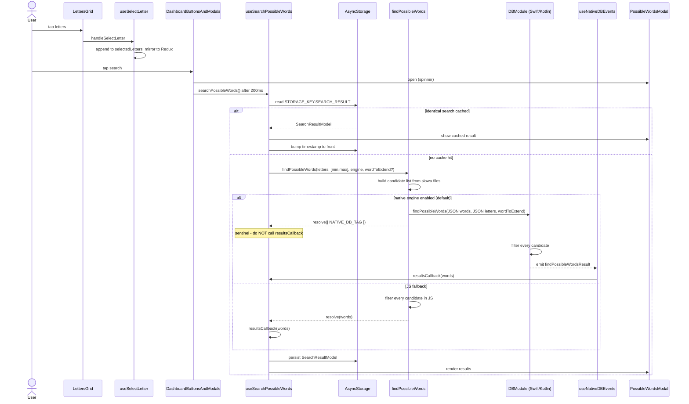
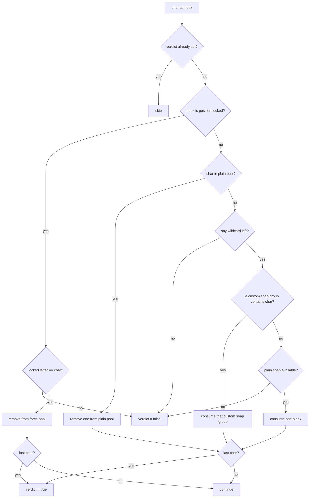

# 02 — The Search Engine

This is the heart of the product: given the letters on a player's rack, find every valid Polish word
that can be built from them. Everything else in the app is secondary.

- [The word database](#the-word-database)
- [Letter encoding](#letter-encoding)
- [End-to-end flow](#end-to-end-flow)
- [The matching algorithm](#the-matching-algorithm)
- [Three implementations](#three-implementations)
- [Result delivery: the event trap](#result-delivery-the-event-trap)
- [Scoring](#scoring)
- [Wildcard highlighting](#wildcard-highlighting)
- [Result caching and search history](#result-caching-and-search-history)
- [Word extension (advanced search)](#word-extension-advanced-search)
- [Performance characteristics](#performance-characteristics)

---

## The word database

The corpus is Polish Scrabble-legal words, stored as **TypeScript source files in the JS bundle**,
one file per word length.

### Format

Each file is a single default-exported string with words separated by dots:

```ts
export default 'aa.ad.ag.aj.al.am.ar.as.at.au.aż.ba.be.bi.bo.bu.by.ce.ci.co...'
```

Words are stored **lowercase** and uppercased at comparison time.

### Inventory

| File | Word length | Words | Size |
| --- | --- | --- | --- |
| `slowa2.ts` | 2 | 133 | 438 B |
| `slowa3.ts` | 3 | 1,654 | 7.2 KB |
| `slowa4.ts` | 4 | 8,313 | 45 KB |
| `slowa5.ts` | 5 | 28,819 | 188 KB |
| `slowa6.ts` | 6 | 65,409 | 495 KB |
| `slowa7.ts` | 7 | 130,096 | 1.1 MB |
| `slowa8.ts` | 8 | 215,919 | 2.1 MB |
| `slowa9.ts` | 9 | 311,112 | 3.3 MB |
| `slowa10.ts` | 10 | 392,946 | 4.6 MB |
| `slowa11.ts` | 11 | 446,509 | 5.7 MB |
| `slowa12.ts` | 12 | 460,433 | 6.3 MB |
| `slowa13.ts` | 13 | 439,580 | 6.5 MB |
| `slowa14.ts` | 14 | 393,512 | 6.2 MB |
| `slowa15.ts` | 15 | 326,317 | 5.5 MB |
| **Total** | 2–15 | **~3,220,000** | **~42 MB** |

### These files are gitignored

`.gitignore` excludes `/src/assets/slowa*.ts`. They are produced from a source `slowa.ts` (also
gitignored) by `scripts/filter-words-by-length.js`:

```bash
cd scripts
node filter-words-by-length.js 7     # writes ../src/assets/slowa7.ts
```

**If these files are missing the app will not compile**, because the helpers import them statically.
This is the single biggest onboarding trap in the repository.

### Two index arrays

The files are indexed by word length via two arrays whose index positions are padded so
`array[n]` is always the file for `n`-letter words.

```16:16:src/dashboard/helpers/find-possible-words.helper.ts
export const allWordsByLength = ['', '', slowa2, slowa3, slowa4, slowa5, slowa6, slowa7, slowa8, slowa9]
```

```ts
// src/dashboard/helpers/find-possible-long-words.helper.ts
export const longWordsByLength = [
  '', '', '', '', '', '', '', '', '', '',
  slowa10, slowa11, slowa12, slowa13, slowa14, slowa15,
]
```

The split into two arrays (2–9 vs 10–15) is historical: long-word support was added later, in v1.17.0,
when search was extended from 9 to 15 letters. The lookup falls back from one to the other:

```33:36:src/dashboard/helpers/find-possible-words.helper.ts
  const allWords = R.times(
    (index: number) => (allWordsByLength[minLength + index] ?? longWordsByLength[minLength + index]).split('.'),
    maxLength - minLength + 1
  ).flat().reverse()
```

Note `.reverse()`: the candidate list is ordered longest-first, so results arrive roughly in order of
descending word length.

---

## Letter encoding

A "selected letter" is a string, and the string can carry more than a plain character. Three sigils
are defined in `src/core/letter-card/letter-card.constants.ts`:

| Constant | Value | Encoded as | Meaning |
| --- | --- | --- | --- |
| `LETTER_SOAP` | `?` | `"?"` | Blank tile — matches any single letter |
| `LETTER_SOAP_PLACEHOLDER` | `*` | `"A*B*C"` | Restricted blank — matches A, B or C only |
| `LETTER_INDEX_SEPARATOR` | `!` | `"A!3"` | Position lock — an A must appear at index 3 |

"Soap" (`mydło`) is the project's word for a blank/wildcard tile.

### Examples of a rack array

```ts
[ 'K', 'O', 'T' ]              // three plain letters
[ 'K', 'O', '?' ]              // K, O and one blank
[ 'K', 'O', 'A*E*Y' ]          // K, O and a blank restricted to A, E or Y
[ 'K!0', 'O', 'T' ]            // K must be the first letter of the word
[ 'K!0', '?', 'T!2', 'A*E' ]   // combinations are allowed
```

### How each rack entry is classified

Before matching, the rack is partitioned into four pools:

```64:80:src/dashboard/helpers/find-possible-words.helper.ts
      let soap_letters = selectedLetters
        .filter((letter: string) => letter === LETTER_SOAP)

      let custom_soap_letters = selectedLetters
        .filter((letter: string) => letter.includes(LETTER_SOAP_PLACEHOLDER))
        .map((customSoapLetters: string) => customSoapLetters.split(LETTER_SOAP_PLACEHOLDER))

      let force_index_letters = selectedLetters
        .filter((letter: string) => letter.includes(LETTER_INDEX_SEPARATOR))

      let _letters = selectedLetters
        .filter((letter: string) => letter !== LETTER_SOAP && !letter.includes(LETTER_SOAP_PLACEHOLDER))
```

Note that `_letters` (the plain pool) **also contains the force-index entries** in their raw
`"A!3"` form, because the filter only excludes soap and custom soap. This matters: a position-locked
letter is consumed by the forced-index branch, not by the plain-letter branch.

### Where the encodings come from in the UI

| Encoding | Produced by |
| --- | --- |
| `?` | Tapping the `?` tile in `LettersGrid` |
| `A*B*C` | Long-pressing a `?` tile → `SoapLetterModal` → picking multiple letters (`useSoapModal`) |
| `A!3` | Long-pressing a selected letter → `ForceIndexModal` → picking a position (`useSelectLetter.handleForceIndex`) |

---

## End-to-end flow



---

## The matching algorithm

Identical logic in all three implementations. For a single candidate word:

### Step 0 — length pre-check (JS only)

```60:62:src/dashboard/helpers/find-possible-words.helper.ts
      const tooLongWord = word.length > selectedLetters.length
      _log(`#1 ${word}, tooLongWord: ${tooLongWord}`)
      if (tooLongWord) return false
```

The native implementations skip this shortcut and rely on the letter pools running out instead.

### Step 1 — fresh pools per word

The four pools are rebuilt from the rack for every candidate, then consumed destructively as the
word is walked.

### Step 2 — walk the word left to right

For each character at `index` (uppercased):



The verdict variable is tri-state so the loop can short-circuit: `null` in JS (`-1` in Swift/Kotlin)
means undecided, and any concrete value stops further evaluation.

### Step 3 — verdict

The word is kept if the verdict is `true`. Note the consequence of the "last char" check: a word only
passes if the loop actually reaches its final character with an undecided verdict. Leftover unused
rack letters are fine — the rack may be longer than the word.

### Precedence notes worth remembering

1. **Position locks win.** If index `i` is locked, the character at `i` must match the locked letter
   exactly. No wildcard can substitute for a locked position.
2. **Custom soap is tried before a plain blank.** This greedily consumes the *first* matching custom
   group, which is not necessarily optimal — with `A*B` and `B*C` in the rack and a word needing both
   a B and a C, the wrong group can be consumed and a valid word rejected. This is a real (rare)
   false-negative in all three implementations.
3. **Duplicates are handled by removal.** Each match removes exactly one entry from a pool, so a rack
   with one `A` cannot satisfy a word with two `A`s unless a wildcard covers the second.

---

## Three implementations

The same algorithm exists in three languages and **must be kept in sync**.

| | JS | iOS | Android |
| --- | --- | --- | --- |
| File | `src/dashboard/helpers/find-possible-words.helper.ts` | `ios/DBModule.swift` | `android/.../DBModuleManager.kt` |
| Lines | 55–178 | 37–134 | 57–124 |
| Verdict sentinel | `null` / `true` / `false` | `-1` / `0` / `1` | `-1` / `0` / `1` |
| Length pre-check | yes | no | no |
| Word extension | **not supported** | yes | yes |
| Returns via | resolved Promise | `findPossibleWordsResult` event | `findPossibleWordsResult` event |
| Result payload | `string[]` | `[String]` | JSON string (Gson) |
| Threading | JS thread | main thread | native modules thread |

### Which one runs

Controlled by `settings.nativeSearchEngineEnabled`, **default `1` (native)**. Toggled on the
Developer screen (More → advanced settings).

```39:47:src/dashboard/helpers/find-possible-words.helper.ts
  if (nativeSearchEngineEnabled) {
    const _selectedLetters = wordToExtend
      ? [ ...selectedLetters, ...wordToExtend.split('').map((char: string) => char.toUpperCase()) ]
      : selectedLetters

    DB.findPossibleWords(allWords, _selectedLetters, wordToExtend)
    resolve([ NATIVE_DB_TAG ])
    return [ NATIVE_DB_TAG ]
  }
```

The JS path explicitly bails out of advanced search:

```49:52:src/dashboard/helpers/find-possible-words.helper.ts
  // Advanced search is not supported in JS engine
  if (wordToExtend?.length) {
    return []
  }
```

(Note this `return` is inside a `Promise` executor and never calls `resolve`, so with the JS engine an
advanced search never settles. In practice the Advanced Search screen refuses to render its UI when
the native engine is off, so the path is unreachable.)

### The bridge wrapper

```6:19:src/native-db/native-db.ts
export const DB: NativeDB = {
  findPossibleWords: (
    allWords: string[],
    selectedLetters: string[],
    wordToExtend?: string,
  ): string[] => {
    _nativeModule.findPossibleWords(
      JSON.stringify(allWords),
      JSON.stringify(selectedLetters),
      wordToExtend,
    )

    return []
  },
  _nativeModule,
}
```

**The entire candidate list is JSON-stringified and copied across the bridge on every search.** For a
2–15 letter search that is tens of megabytes of string. See
[Performance characteristics](#performance-characteristics).

---

## Result delivery: the event trap

This is the single most confusing part of the codebase.

`DBModule.findPossibleWords` is **not** a Promise-returning method. It returns immediately
(iOS returns the input string; Android returns `true`) and results arrive later as an event. To make
the JS call site uniform, `findPossibleWords` resolves with a sentinel:

```ts
// src/native-db/native-db.constants.ts
export const NATIVE_DB_TAG = 'NATIVE_DB'
```

The caller must check for it and ignore that "result":

```69:73:src/dashboard/hooks/use-search-possible-words.hook.ts
      ).then((result: string[]) => {
        if (!R.includes(NATIVE_DB_TAG, result)) {
          resultsCallback(result)
        }
      })
```

The real results arrive through `useNativeDBEvents`, which uses a different emitter per platform:

```7:18:src/native-db/hooks/use-native-sb-events.hook.ts
  React.useEffect(() => {
    const eventEmitter = Platform.OS === 'android' ? null : new NativeEventEmitter(NativeModules.EventEmitter) as any

    if (Platform.OS === 'android') {
      DeviceEventEmitter.addListener('findPossibleWordsResult', (result: string) => {
        resultCallback(JSON.parse(result))
      })
    } else {
      eventEmitter.addListener('findPossibleWordsResult', (result: string[]) => {
        resultCallback(result)
      })
    }
```

| Platform | Emitter | Payload |
| --- | --- | --- |
| iOS | `NativeEventEmitter(NativeModules.EventEmitter)` | `string[]`, used as-is |
| Android | `DeviceEventEmitter` | JSON string, must be `JSON.parse`d |

### Implications when changing this code

- There is **no request id**. If two searches overlap, the second event overwrites the first result
  with no way to tell which search it belongs to.
- There is **no cancellation** and **no timeout**. If the native side throws, the callback simply
  never fires and the modal spins forever.
- The cleanup calls `removeAllListeners`, which is global rather than scoped to this subscription, so
  mounting two consumers of `useNativeDBEvents` and unmounting one kills both.
- Android declares a `searchEngineProgress` event that is **never emitted** — the helper exists but is
  dead code.

---

## Scoring

Polish Literaki point values, expressed as four letter groups:

```1:10:src/core/letter-card/letter-card.constants.ts
export const LETTERS_1 = [
  'A', 'E', 'I', 'N', 'O', 'R', 'S', 'W', 'Z',
]

export const LETTERS_2 = [
  'C', 'D', 'K', 'L', 'M', 'P', 'T', 'Y',
]

export const LETTERS_3 = [
  'B', 'G', 'H', 'J', 'Ł', 'U',
]
```

| Points | Letters |
| --- | --- |
| 1 | A E I N O R S W Z |
| 2 | C D K L M P T Y |
| 3 | B G H J Ł U |
| 5 | Ą Ć Ę F Ń Ó Ś Ź Ż |
| 0 | anything else (including `?`, `*`, `!`) |

```12:17:src/dashboard/helpers/get-word-points.helper.ts
export const getWordPoints = R.pipe<string[], string, string[], number[], number>(
  R.toUpper,
  R.split(''),
  R.map(mapCharacterToPoint),
  R.sum,
)
```

This is a raw tile sum. It does **not** model board premiums (double/triple letter or word squares) —
those exist only as visual decoration in the Playground. Results are sorted by this value descending
within each word-length group.

---

## Wildcard highlighting

When results are displayed, tiles filled by a blank are drawn differently. Which positions those are
is recomputed per word by replaying a simplified version of the matching walk:

```4:24:src/dashboard/helpers/get-soap-characters-indexes.helper.ts
export const getSoapCharactersIndexes = (word: string, _selectedLetters: string[]) => {
  let soapIndexes: number[] = []
  let _letters = _selectedLetters
  const forcedIndexes = _selectedLetters
    ?.map((letter: string) => letter.includes(LETTER_INDEX_SEPARATOR) ? Number(letter?.split(LETTER_INDEX_SEPARATOR)?.[1]) : null)
    .filter((value: number | null) => value !== null)

  word.toUpperCase().split('').filter((value: string) => value !== LETTER_SOAP).forEach((character: string, index: number) => {
    if (forcedIndexes.includes(index)) {
      return
    }

    if (_letters.includes(character)) {
      _letters = R.remove(R.findIndex(R.equals(character), _letters), 1, _letters)
    } else {
      soapIndexes = R.append(index, soapIndexes)
    }
  })

  return soapIndexes
}
```

Any position whose character cannot be sourced from the plain rack is reported as wildcard-filled.
This is an approximation of the real matcher — it does not distinguish plain blanks from custom soap
groups — but it is display-only.

The history modal passes the *historical* rack rather than the current one, so old results highlight
correctly:

```ts
soapCharactersIndexes(word, item.selectedLetters)
```

---

## Result caching and search history

Search results and search history are the same data. Every completed search is prepended to a single
AsyncStorage entry.

### The stored model

```1:6:src/core/storage/storage.models.ts
export interface SearchResultModel {
  wordLength: [ number, number ];
  selectedLetters: string[];
  result: string[];
  timestamp: number;
}
```

Stored as a JSON array under `STORAGE_KEY.SEARCH_RESULT` (`@searchResult` in AsyncStorage), newest first.

### Cache lookup

Before running a search, an identical previous search is looked up. "Identical" means the same word
length range and the same rack **ignoring order**:

```8:15:src/dashboard/helpers/get-results-already-saved-index.helper.ts
) => savedResults.findIndex((savedResult: SearchResultModel) => {
  const _savedResultSelectedLetters = [ ...savedResult.selectedLetters ]

  return (
    wrzw.compareJoined(savedResult.wordLength, wordLengthRef.current) &&
    wrzw.compareJoined(_selectedLetters.sort(), _savedResultSelectedLetters.sort())
  )
})
```

On a hit, the entry is moved to the front with a fresh timestamp (`updateStorageSearchResult`),
giving the history an LRU-like ordering. Advanced searches (`wordToExtend` set) bypass the cache
entirely.

### Cache growth

Nothing prunes this list. Every distinct search appends a full result array — a broad 2–15 letter
search can return tens of thousands of words. The only way to shrink it is the manual
**Developer → search history → clear** action. Import/export to a text file is available on the same
screen and goes through the native `FSModule`.

### Invalidation signal

`dashboard.searchHistoryTimestamp` in Redux exists solely so that other screens can force the history
list to re-read from storage after an import or a clear.

---

## Word extension (advanced search)

The advanced search answers a different question: *"what can I build using a word already on the
board plus my rack?"*

Implementation, in `findPossibleWords`:

1. The board word's characters are appended to the rack, so the matcher can spend them:
   ```40:42:src/dashboard/helpers/find-possible-words.helper.ts
       const _selectedLetters = wordToExtend
         ? [ ...selectedLetters, ...wordToExtend.split('').map((char: string) => char.toUpperCase()) ]
         : selectedLetters
   ```
2. `wordToExtend` is also passed to the native module, which adds a substring filter after the normal
   match: the candidate must `contain` the board word (case-insensitive).
3. The word-length range is overridden to span everything reachable:
   ```60:62:src/dashboard/hooks/use-search-possible-words.hook.ts
         const wordLength: [ number, number ] = wordToExtend
           ? [1, wordToExtend.length + selectedLetters.length]
           : wordLengthRef.current
   ```

The substring check lives **only in the native implementations**, which is why advanced search
requires the native engine.

Constraint enforced in the UI: `WordExtension` sets `maxLength = 15 - selectedLetters.length`, so the
board word plus rack can never exceed 15 characters.

---

## Performance characteristics

| Aspect | Reality |
| --- | --- |
| Complexity | O(W × L) per search — W candidates, L average word length |
| Index structures | none — no trie, DAWG, anagram map or letter-signature index |
| Candidate pruning | only the word-length range chosen on the slider |
| Bridge cost | full candidate list JSON-serialized per call, results serialized back |
| Threading (iOS) | main thread — the UI is blocked for the duration |
| Threading (Android) | native modules thread — the bridge is blocked |
| Progress reporting | none (Android has a dead `searchEngineProgress` helper) |
| Paging | none — every match is emitted in one event |
| Cancellation | none |
| Memory | the whole corpus is a resident set of JS strings once imported |

### Why it still feels acceptable

- Default searches are narrow. The slider defaults to `[2, 8]`, and non-premium users are capped at 9
  letters, which avoids the largest files entirely.
- Results are cached, so repeating a search is instant.
- The results modal opens with a spinner *before* the search starts (a deliberate 200 ms delay in
  `DashboardButtonsAndModals`), so the freeze is hidden behind a loading state.
- The results list is paginated at 30 words per page in `useWordDetail`, so rendering does not
  compound the cost.

### If you rewrite this

The highest-leverage change is to stop shipping the corpus through the bridge: move the word files
into native assets (iOS bundle resource / Android `assets/`) and have `DBModule` load them itself,
optionally into a precomputed letter-signature index. That removes the serialization cost, allows
background threading with progress and cancellation, and makes 15-letter searches viable.
See [`11-tech-debt-and-modernization.md`](11-tech-debt-and-modernization.md).
