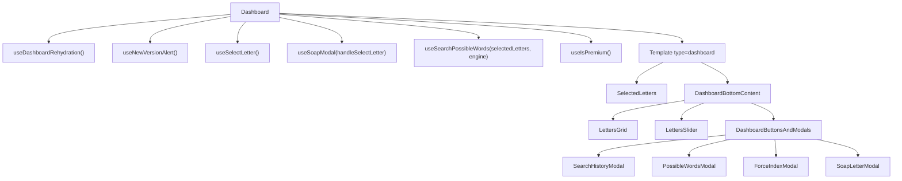

# 03 — Dashboard, Advanced Search & the Native Bridge

The Dashboard is the app's primary screen and the reason the product exists. This document covers
`src/dashboard/`, `src/advanced-search/` and `src/native-db/`.

For the search algorithm itself see [`02-search-engine.md`](02-search-engine.md).

- [Dashboard screen](#dashboard-screen)
- [Redux slice](#redux-slice)
- [Hooks](#hooks)
- [Helpers](#helpers)
- [Components](#components)
- [Advanced search](#advanced-search)
- [The native bridge](#the-native-bridge)

---

## Dashboard screen

**File:** `src/dashboard/dashboard.tsx` (~75 lines)

The screen is pure composition: it calls seven hooks and passes their return values down as props.
No business logic lives here.



### Hook wiring

```17:44:src/dashboard/dashboard.tsx
export const Dashboard = () => {
  useDashboardRehydration()
  const forceIndexModalizeRef = React.useRef<Modalize>(null)
  const forceIndexLetterIndexRef = React.useRef<null | number>(null)
  const nativeSearchEngineEnabled = useSelector(nativeSearchEngineEnabledSelector)

  useNewVersionAlert()

  const {
    letters, selectedLetters,
    handleSelectLetter, handleDeselectLetter, handleClearSelectedLetters, soapCharactersIndexes, handleForceIndex,
  } = useSelectLetter()

  const { handleLongPress, onSelectSoapLetters, soapModalizeRef } = useSoapModal(handleSelectLetter)

  const {
    possibleWords, onLengthChange, noWordsFound, searchPossibleWords, clearPossibleWords,
  } = useSearchPossibleWords(selectedLetters, nativeSearchEngineEnabled)

  const isPremium = useIsPremium()
  const sliderDefaultValues: LetterSliderDefaultValues = [ 2, 8, 2, 15, isPremium ? 15 : 9 ]
```

`sliderDefaultValues` is `[ defaultMin, defaultMax, rangeMin, rangeMax, premiumCap ]`: the slider
starts at 2–8, can move between 2 and 15, but non-premium users are blocked above 9.

### Memoization

The entire returned tree is memoized on three values:

```49:71:src/dashboard/dashboard.tsx
  return React.useMemo(() => (
    <Template
      type="dashboard"
      leftIcon="cogs"
      leftScreen={SCREEN.DASHBOARD_ADVANCED_SEARCH}
      navigationParams={navigationParams}
    >
```

The dependency array is `[ selectedLetters, letters, possibleWords ]`. This is a deliberate render
optimization for the 35-tile grid, but it also means **anything else that changes will not re-render
the screen**. If you add state to `Dashboard` and it appears not to update, this is why.

### Header configuration

`leftIcon="cogs"` + `leftScreen={SCREEN.DASHBOARD_ADVANCED_SEARCH}` puts a gear icon in the header
that navigates to Advanced Search, passing the current rack through `navigationParams`.

---

## Redux slice

**Files:** `src/dashboard/store/dashboard.slice.ts`, `dashboard.selectors.ts`

```ts
interface DashboardState {
  selectedLetters: string[];
  searchHistoryTimestamp: number;   // initial: new Date().getTime()
}
```

| Action | Payload | Effect |
| --- | --- | --- |
| `setSelectedLettersAction` | `string[]` | Replaces the rack |
| `setSearchHistoryTimestampAction` | `number` | Invalidation signal for the history list |

| Selector | Fallback |
| --- | --- |
| `selectedLettersSelector` | `[]` |
| `searchHistoryTimestampSelector` | `0` |

**The rack is not owned by Redux.** `useSelectLetter` holds it in local state and mirrors it into the
store on every change, so other screens can read it. Dispatching `setSelectedLettersAction` from
outside the hook will be overwritten on the next local change.

Consumers of `selectedLettersSelector`: `src/playground/playground.tsx` (shows the count) and,
indirectly, Advanced Search (which receives the rack as a navigation param).

The slice variable is named `settingsSlice` in `dashboard.slice.ts` — a copy-paste artifact. The
slice `name` and the exported `dashboardReducer` are correct.

---

## Hooks

### `useSelectLetter()`

**File:** `src/dashboard/hooks/use-select-letter.hook.ts`

Owns the rack.

```ts
interface UseSelectLetter {
  letters: string[];
  selectedLetters: string[];
  handleSelectLetter: (letter: string) => void;
  handleDeselectLetter: (index: number) => () => void;
  handleForceIndex: (letterIndex: number, forceIndex: number) => void;
  soapCharactersIndexes: (letter: string) => number[];
  handleClearSelectedLetters: () => void;
}
```

The available tile set is the Polish alphabet plus three blanks:

```40:40:src/dashboard/hooks/use-select-letter.hook.ts
  const letters = [ ...ALL_LETTERS_SORTED, LETTER_SOAP, LETTER_SOAP, LETTER_SOAP ]
```

Selection is capped twice — a hard limit of 15 and a premium limit of 9:

```46:57:src/dashboard/hooks/use-select-letter.hook.ts
  const handleSelectLetter = (letter: string) => {
    LayoutAnimation.easeInEaseOut()
    triggerHaptic()

    if (hasMaxNoPremiumSelectedLetters) {
      goPremiumAlert(() => {
        navigation.navigate(SCREEN.MORE)
      })
    } else if (hasMaxSelectedLetters) {
      updateSelectedLetters(R.append(letter, selectedLetters))
    }
  }
```

Position locking rewrites the entry in place, replacing any existing lock:

```59:69:src/dashboard/hooks/use-select-letter.hook.ts
  const handleForceIndex = (letterIndex: number, forceIndex: number) => {
    if (selectedLetters[letterIndex].includes(LETTER_INDEX_SEPARATOR)) {
      updateSelectedLetters(
        R.update(letterIndex, `${selectedLetters[letterIndex].split(LETTER_INDEX_SEPARATOR)[0]}!${forceIndex}`),
      )
    } else {
      updateSelectedLetters(
        R.update(letterIndex, `${selectedLetters[letterIndex]}!${forceIndex}`),
      )
    }
  }
```

The Redux mirror is a plain effect:

```42:44:src/dashboard/hooks/use-select-letter.hook.ts
  React.useEffect(() => {
    dispatch(setSelectedLettersAction(selectedLetters))
  }, [ selectedLetters ])
```

### `useSearchPossibleWords(selectedLetters, nativeSearchEngineEnabled, wordToExtend?)`

**File:** `src/dashboard/hooks/use-search-possible-words.hook.ts`

Orchestrates cache lookup, engine dispatch and result persistence.

```ts
interface UseSearchPossibleWords {
  possibleWords: string[];
  noWordsFound: boolean;
  searchPossibleWords: () => void;
  onLengthChange: (minMax: [ number, number ]) => void;
  clearPossibleWords: () => void;
}
```

Internal refs:

| Ref | Purpose |
| --- | --- |
| `selectedLettersRef` | Current rack, readable from the event callback without stale closure |
| `wordLengthRef` | Slider range, default `[ 1, 10 ]` — a ref so slider drags don't re-render |
| `savedResultRef` | Last-read history array, reused when persisting |

The result path is shared by both engines:

```48:54:src/dashboard/hooks/use-search-possible-words.hook.ts
  const resultsCallback = (result: string[]) => {
    setNoWordsFound(wrzw.isE(result))
    setPossibleWords(result)
    saveResult(result)
  }

  useNativeDBEvents(resultsCallback)
```

Cache-first behaviour, skipped for advanced search:

```76:92:src/dashboard/hooks/use-search-possible-words.hook.ts
    const savedResults = await Storage.get<SearchResultModel[]>(STORAGE_KEY.SEARCH_RESULT)

    if (!wordToExtend?.length && savedResults !== null) {
      savedResultRef.current = savedResults
      const _selectedLetters = [ ...selectedLetters ]
      const resultAlreadySavedIndex = getResultAlreadySavedIndex(savedResults, _selectedLetters, wordLengthRef)

      if (savedResults[resultAlreadySavedIndex]) {
        setNoWordsFound(wrzw.isE(savedResults[resultAlreadySavedIndex].result))
        setPossibleWords(savedResults[resultAlreadySavedIndex].result)
        updateStorageSearchResult(resultAlreadySavedIndex, savedResults)
      } else {
        searchWords()
      }
    } else {
      searchWords()
    }
```

`onLengthChange` guards against redundant writes with `wrzw.compareJoined`, so dragging the slider
across the same values does nothing.

### `useSoapModal(handleSelectLetter)`

**File:** `src/dashboard/hooks/use-soap-modal.hook.ts`

Turns a multi-letter selection into the `A*B*C` encoding; a single letter is added as a plain tile:

```20:26:src/dashboard/hooks/use-soap-modal.hook.ts
  const onSelectSoapLetters = (soapLetters: string[]) => {
    if (soapLetters.length === 1) {
      handleSelectLetter(soapLetters[0])
    } else {
      handleSelectLetter(soapLetters.join(LETTER_SOAP_PLACEHOLDER))
    }
  }
```

### `useSearchHistory()`

**File:** `src/dashboard/hooks/use-search-history-modal.hook.ts`

Exposes the history modal ref and whether the history button should be visible. Re-checks storage
whenever the Redux timestamp changes:

```27:29:src/dashboard/hooks/use-search-history-modal.hook.ts
  React.useEffect(() => {
    checkHistoryAvailable()
  }, [ searchHistoryTimestamp ])
```

Exported from the barrel as `useSearchHistory` even though the file is named
`use-search-history-modal.hook.ts`.

### `useWordDetail(possibleWords, wordDetailsModalRef)`

**File:** `src/dashboard/hooks/use-word-detail.hook.ts`

Pagination and grouping for the results list. 30 words per page.

```30:43:src/dashboard/hooks/use-word-detail.hook.ts
  const getWordsByLettersCount = () => {
    let wordsToDisplay: string[][] = []

    const words = R.sortWith(
      [ R.descend(R.prop('length')) ],
      R.slice(0, RESULTS_COUNT * resultsCountMultiplier, possibleWords),
    )

    words.forEach((word: string) => {
      wordsToDisplay[word.length] = R.append(word, wordsToDisplay[word.length] ?? [])
    })

    return reverseNotNilWords(wordsToDisplay)
  }
```

Words are sliced first, then sorted by length descending, then bucketed into a sparse array indexed by
length, which `reverseNotNilWords` compacts and reverses. `loadMore` bumps the multiplier behind a
100 ms timeout purely so the spinner is visible.

### `useWordDefinitions(word)`

**File:** `src/dashboard/hooks/use-word-definitions.hook.ts`

Fetches `https://sjp.pl/{word}` through `fetchClient` and runs the HTML through
`parseSjpWordDetails`. Returns `null` while loading and `[]` on error.

### `useDashboardRehydration()`

Loads `LANGUAGE_CODE` (raw), `HAPTIC_FEEDBACK_ENABLED`, `NATIVE_SEARCH_ENGINE_ENABLED` and `PREMIUM`
from AsyncStorage into Redux. Because Dashboard is the initial screen, this is effectively the app's
settings bootstrap. See [`01-architecture.md`](01-architecture.md#settings-rehydration).

### `useGesturesEnabled()`

Android-only workaround: `react-native-modalize`'s pan gesture fights the inner scroll view, so the
pan handler is disabled once the list is scrolled and re-enabled at the top. On iOS the hook returns
`noop` handlers.

---

## Helpers

**Directory:** `src/dashboard/helpers/`

| Helper | Signature | Purpose |
| --- | --- | --- |
| `findPossibleWords` | `(letters, [min,max], engineFlag, wordToExtend?) => Promise<string[]>` | The search entry point. Builds the candidate pool, dispatches to native or filters in JS. Documented in [`02-search-engine.md`](02-search-engine.md). |
| `allWordsByLength` | `string[]` | Word files for lengths 2–9, index-aligned. |
| `longWordsByLength` | `string[]` | Word files for lengths 10–15, index-aligned. |
| `getWordPoints` | `(word: string) => number` | Sum of Polish Literaki tile values. |
| `getSoapCharactersIndexes` | `(word, selectedLetters) => number[]` | Which result positions were filled by a wildcard. |
| `getResultAlreadySavedIndex` | `(savedResults, letters, wordLengthRef) => number` | Cache lookup by order-insensitive rack + length range. |
| `updateStorageSearchResult` | `(index, savedResults) => void` | Moves a cached entry to the front with a fresh timestamp. |
| `isForceIndexAvailable` | `(letter: string) => boolean` | Whether a tile can be position-locked (single char or already locked, never a blank). |
| `parseSjpWordDetails` | `(html: string) => string[]` | Scrapes definitions out of an sjp.pl page. |
| `reverseNotNilWords` | `(words: string[][][]) => string[][]` | Compacts and reverses the sparse length-indexed buckets. |
| `toggleSelectedSoapLetters` | `<T>(letter: string) => (arr: T[]) => T[]` | Toggles a letter in the soap-modal selection. |

### `parseSjpWordDetails` is HTML scraping

```ts
// simplified shape of the pipeline
text.split('znaczenie')[1]
    .split('KOMENTARZE')[0]
    .split('max-width: 34em; ">')[1]
    .split('</p>')[0]
    .split('<br />')
    .map(line => line.split('. ')[1]?.trim())
    .filter(Boolean)
```

This is tightly coupled to sjp.pl's markup and will break silently if that site changes. It is the
only external dependency of the app besides Firebase.

---

## Components

**Directory:** `src/dashboard/components/`

### `SelectedLetters`

The rack display. Two rows: the first eight tiles, then the rest plus a `+?` button.

| Prop | Type | Notes |
| --- | --- | --- |
| `selectedLetters` | `string[]` | required |
| `handleDeselectLetter` | `(index) => () => void` | optional |
| `onLongPressSelectedLetter` | `(index) => () => void` | optional |
| `handleSelectLetter` | `(letter) => void` | optional |
| `handleLongPress` | `() => void` | optional |

**Passing no handlers makes it read-only** — this is how Advanced Search reuses it.

Tap deselects; long-press opens the force-index modal, but only when
`isForceIndexAvailable(selectedLetters[index])`:

```45:50:src/dashboard/dashboard.tsx
  const onLongPressSelectedLetter = (index: number) => () => {
    if (isForceIndexAvailable(selectedLetters[index])) {
      forceIndexModalizeRef?.current?.open?.()
      forceIndexLetterIndexRef.current = index
    }
  }
```

### `LettersGrid`

The 32-letter Polish alphabet plus three blanks, laid out in rows of eight via `R.splitEvery(8, ...)`.

| Prop | Type | Notes |
| --- | --- | --- |
| `letters` | `string[]` | optional; defaults to the full alphabet |
| `handleSelectLetter` | `(letter, index) => void` | required |
| `handleLongPress` | `() => void` | opens the soap modal from a `?` tile |
| `selectable` | `boolean` | multi-select mode, used inside `SoapLetterModal` |
| `selectedLetters` | `string[]` | for highlighting in selectable mode |

Disabled once 15 tiles are selected.

### `DashboardButtonsAndModals`

Owns the three action buttons and mounts all four modals inside a `Portal`.

| Button | Color | Visible when |
| --- | --- | --- |
| History | `DARK_SEA_GREEN` | `historyAvailable` |
| Search | default (blue) | `selectedLetters.length >= 2` |
| Clear | `FIRE_BRICK` | `selectedLetters.length > 0` |

The deliberate delay that hides the search freeze:

```47:53:src/dashboard/components/dashboard-buttons-and-modals/dashboard-buttons-and-modals.tsx
  const onSearch = () => {
    modalizeRef?.current?.open()
    setTimeout(() => {
      setHistoryAvailable(true)
      searchPossibleWords()
    }, 200)
  }
```

The modal opens first, shows its spinner, and only then does the (blocking) search start.

### `PossibleWordsModal`

The results sheet. Three states: spinner, "nothing found" icon, or the grouped list.

| Prop | Type |
| --- | --- |
| `possibleWords` | `string[]` |
| `noWordsFound` | `boolean` |
| `modalizeRef` | `React.MutableRefObject<any>` |
| `soapCharactersIndexes` | `(word) => number[]` |
| `onOpened` / `onClosed` | `() => void` |

Rendering: results grouped by length (longest first), sorted by `getWordPoints` descending inside each
group, each word drawn as a row of `LetterCard`s with wildcard positions highlighted. Long-press a
word to open `WordDetailsModal`. Pagination through `useWordDetail` with
`PossibleWordsModalFooter` as the "load more" control.

### `SearchHistoryModal` / `SearchHistoryModalItem`

Reads `STORAGE_KEY.SEARCH_RESULT` on open and lists past searches: date, length range and the rack as
tiles. Tapping an entry opens a **nested** `PossibleWordsModal` with the cached results.

Each item passes its own historical rack into `soapCharactersIndexes`, so wildcard highlighting is
correct for that search rather than for the current rack.

### `SoapLetterModal`

A `LettersGrid` in `selectable` mode. Picking one or more letters and confirming calls
`onSelectSoapLetters`, which produces either a plain tile or the `A*B*C` encoding.

### `ForceIndexModal`

A grid of numbers 1–15. Tapping `n` calls `handleForceIndex(n - 1)` — the UI is 1-based, the encoding
is 0-based.

### `WordDetailsModal`

| Sub-component | Content |
| --- | --- |
| `WordDetailsHeadline` | The word in tiles plus its point total |
| `WordDetialsDefinitions` | Definitions from sjp.pl via `useWordDefinitions` (note the typo in the exported name) |

---

## Advanced search

**Directory:** `src/advanced-search/`
**Screen:** `SCREEN.DASHBOARD_ADVANCED_SEARCH`, reached from the Dashboard header gear icon.

Answers: *"what can I play using a word already on the board plus my rack?"*

### Differences from basic search

| | Basic | Advanced |
| --- | --- | --- |
| Rack editing | full grid, blanks, force index | read-only, inherited via navigation params |
| Word length | slider | automatic, `[ 1, wordToExtend.length + rack.length ]` |
| Word extension | no | yes |
| Engine | native or JS | **native only** |
| Result caching | yes | bypassed |
| History | yes | no |

### Engine gate

The whole UI is behind a check; with the JS engine the screen shows a single message:

```44:65:src/advanced-search/advanced-search.tsx
      {nativeSearchEngineEnabled ? (
        <>
          <Tx local="selected_letters" bolder disabled center />
          <SelectedLetters selectedLetters={selectedLetters} />

          <Tx local="word_extension" bolder disabled center spacings="L 0 0" />
          <WordExtension {...{ wordToExtend, setWordToExtend, selectedLetters }} />
```

Reuse is heavy: `SelectedLetters`, `PossibleWordsModal`, `useSearchPossibleWords`,
`getSoapCharactersIndexes` and even the search button icon are imported from `src/dashboard/`.

### `WordExtension`

| Prop | Type |
| --- | --- |
| `wordToExtend` | `string` |
| `setWordToExtend` | `(value: string) => void` |
| `selectedLetters` | `string[]` |

An auto-capitalizing text input with arrow icons on both sides suggesting the extension direction.
`maxLength = 15 - selectedLetters.length` keeps board word + rack within the 15-tile ceiling.

---

## The native bridge

**Directory:** `src/native-db/`

| File | Contents |
| --- | --- |
| `native-db.ts` | The `DB` object wrapping `NativeModules.DBModule` |
| `native-db.models.ts` | The `NativeDB` interface |
| `native-db.constants.ts` | `NATIVE_DB_TAG = 'NATIVE_DB'` |
| `hooks/use-native-sb-events.hook.ts` | Event subscription (filename says `sb`, it means `db`) |

```ts
interface NativeDB {
  findPossibleWords: (allWords: string[], selectedLetters: string[], wordToExtend?: string) => string[];
  _nativeModule: NativeModulesStatic;
}
```

Arguments are JSON-stringified before crossing the bridge, and the return value is a meaningless empty
array — results arrive on the `findPossibleWordsResult` event instead. The full explanation, including
the per-platform emitter difference and the known limitations (no request id, no cancellation, global
`removeAllListeners`), is in
[`02-search-engine.md`](02-search-engine.md#result-delivery-the-event-trap).

The native implementations themselves are documented in
[`07-native-ios.md`](07-native-ios.md) and [`08-native-android.md`](08-native-android.md).
