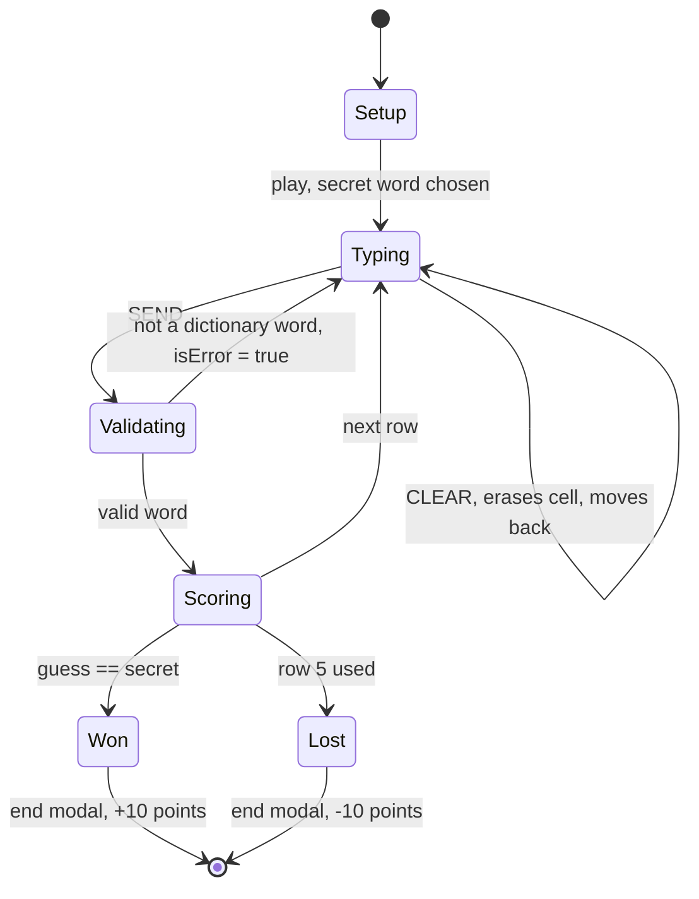

# 04 — Games & Secondary Modules

Everything that is not the main search: two word games, a dictionary lookup, a board sandbox, an
embedded website and the in-app guideline.

- [Charade — the Wordle clone](#charade--the-wordle-clone)
- [Dictionarly — the alphabetical narrowing game](#dictionarly--the-alphabetical-narrowing-game)
- [Dictionary — word lookup](#dictionary--word-lookup)
- [Playground — the board sandbox](#playground--the-board-sandbox)
- [Mania — embedded website](#mania--embedded-website)
- [Help — the guideline](#help--the-guideline)
- [Shared patterns across games](#shared-patterns-across-games)

---

## Charade — the Wordle clone

**Directory:** `src/charade/`
**Screens:** `Charade-Main` (setup), `Charade-Play`, plus `Charade-Playground` in the same stack.

### The game

A Polish Wordle. The player picks a word length and whether repeated letters are allowed, then gets
six attempts to guess a randomly chosen dictionary word using an on-screen Polish keyboard. Every
submitted guess must itself be a valid dictionary word. After each guess, letters are colored:

| Color | `COLOR` | Meaning |
| --- | --- | --- |
| Green | `DARK_SEA_GREEN` | Right letter, right position |
| Yellow | `GOLD` | Right letter, wrong position |
| Red | `FIRE_BRICK` | Letter not in the word |

### Setup

```22:35:src/charade/hooks/use-charade-play.hook.ts
  const handlePlayCharade = () => {
    const getWords = (words: string[]) => getRandomWords(words, (word: string) => word.length === count)
    const allWords = getWords(allWordsByLength)

    let word = allWords[Math.floor(Math.random() * allWords.length)]?.toUpperCase?.()

    if (!allowDuplicatedLetters) {
      while([ ...new Set(word.split('')) ].length !== word.length) {
        word = allWords[Math.floor(Math.random() * allWords.length)]?.toUpperCase?.()
      }
    }

    navigation.navigate(SCREEN.CHARADE_PLAY, { word, allWords })
  }
```

The secret word and the whole candidate list are passed as **navigation params**, not state. Default
length is 5; the counter allows 3–9 (only `allWordsByLength` is used, so 10+ letter words never
appear). The no-duplicates option rerolls in a `while` loop until it finds a word with all-distinct
letters, which for long lengths can spin for a while.

### The grid model

The board is a **flat sparse array with a stride of `count + 1`**, not a 2D array:

```
index = column + (row * (count + 1))
```

The extra `+1` per row leaves a gap between rows, which is why helpers always recompute the offset
rather than using simple `row * count` arithmetic.

### Game loop



The keyboard handler:

```44:88:src/charade/hooks/use-charade-press.hook.ts
  const onPressLetter = React.useCallback((letter: string) => {
    const activeWord = contents.slice((activeRow * (count + 1)), (activeRow * (count + 1)) + count).join('')

    if (letter === SEND_BUTTON_ID) {
      if (!allWords.includes(activeWord.toLowerCase())) {
        setError(true)
        return
      }

      const [ newRedLetters, newGreenLetters, newYellowLetters ] = updateRGYLetters(
        contents, activeRow, count, word, [ redLetters, greenLetters, yellowLetters ],
      )
```

Note the win and lose branches both use a 1000 ms delay before opening the end modal, so the final
row's colors are visible first.

### The RGY logic and its known flaw

```19:31:src/charade/helpers/update-rgy-letters.helper.ts
  letters.forEach((l: string, i: number) => {
    if (word.includes(l)) {
      if (word[i] === l) {
        newGreenLetters = [ ...newGreenLetters, l ]
      } else {
        newYellowLetters = [ ...newYellowLetters, l ]
      }
    } else {
      newRedLetters = [ ...newRedLetters, l ]
    }
  })
```

This is **simpler than real Wordle**. Real Wordle accounts for letter multiplicity: if the secret has
one `A` and you guess two, only one is highlighted. Here each position is judged independently, so
guessing `AAB` against a secret containing a single `A` marks both `A`s. The "no duplicated letters"
setup option exists partly to sidestep this.

The three arrays accumulate across all guesses and are used with `.includes()` to color the keyboard,
so a letter that was yellow once and green later ends up in both arrays. The grid itself does not use
these arrays — it recomputes colors per cell in the styled layer:

```33:47:src/charade/components/charade-field/charade-field.styled.ts
const getCharadeFieldContainerColor = ({ isSent, content, index, word }: CharadeFieldContainerProps) => {
  if (isSent) {
    if (word.includes(content)) {
      if (word[index] === content) {
        return COLOR.DARK_SEA_GREEN
      } else {
        return COLOR.GOLD
      }
    } else {
      return COLOR.FIRE_BRICK
    }
  } else {
    return COLOR.TRANSPARENT
  }
}
```

### Helpers

| Helper | Signature | Purpose |
| --- | --- | --- |
| `createNewContents` | `(activeIndex, activeRow, count, newContent) => (contents) => contents` | Writes one cell in the flat array |
| `getCharadeFieldContent` | `(contents, index, rowIndex, count) => string` | Reads a cell, `''` if empty |
| `updateRGYLetters` | `(contents, activeRow, count, word, [red, green, yellow]) => [red, green, yellow]` | Classifies a submitted row |

### Cheat / debug

`useCharadeSpy(word)` — tap the screen three times, then shake the device to reveal the secret word
via `spyAlert`. Same mechanism exists in Dictionarly.

### Persistence

None locally. On game end, `EndModal` writes to Firebase RTDB through `userStatisticsService`
(subtype `'charade'`, ±10 points) but only when `userUidSelector` is set — anonymous players score
nothing.

---

## Dictionarly — the alphabetical narrowing game

**Directory:** `src/dictionarly/`
**Screens:** `Dictionary-Dictionarly` (setup — the Dictionary tab's initial screen), `Dictionary-Play`.

### The game

Not Wordle. The player guesses a secret word, and each valid guess is filed into one of two lists:
words that come **before** the secret alphabetically, and words that come **after**. The player
narrows down by binary search. Matching leading characters are highlighted so the player can see how
close a guess is.

### Configuration

| Option | Values |
| --- | --- |
| Word pool | short (`allWordsByLength`, 2–9) or long (`longWordsByLength`, 10–15) |
| Difficulty | Easy / Normal / Hard / Very Hard |

Chances by difficulty:

```ts
const CHANCES = [ 14, 12, 10, 8 ][difficulty] ?? DEFAULT_CHANCES
```

Long-word mode additionally requires guesses of at least 10 letters.

### Guess handling

```37:61:src/dictionarly/hooks/use-dictionarly-play.hook.ts
  const onSend = () => {
    LayoutAnimation.easeInEaseOut()
    const allWords = wordsLength ? getDictionaryWords(longWordsByLength) : getDictionaryWords(allWordsByLength)

    if (!allWords.includes(value.toLowerCase())) {
      setState(false)
      return
    }

    const comparison = value.localeCompare(word)

    if (comparison > 0) {
      setWordsAfter(appendSortedWords(value))
      setValue('')
    } else if (comparison < 0) {
      setWordsBefore(appendSortedWords(value))
      setValue('')
    } else {
      setState(true)
      Keyboard.dismiss()
      modalizeRef?.current?.open?.()
    }

    setChances(R.dec)
  }
```

Comparison uses `String.prototype.localeCompare`, which handles Polish diacritics in the expected
alphabetical order (`ą` after `a`, and so on).

Note that the whole word pool is re-split from the dot-separated blobs **on every guess** — for the
long-word pool that is roughly 2.5 million strings allocated per keystroke of the send button.

> **Known bug:** `appendSortedWords(value)` returns a function (a Ramda pipe), so passing it directly
> to `setWordsAfter` relies on React's functional-updater form. This happens to work, but it is
> accidental rather than intentional and is easy to break when refactoring.

### Progress and end

`useDictionarlyPlayProgress` owns the chance counter and opens the end modal when it reaches zero:

```30:36:src/dictionarly/hooks/use-dictionarly-play-progress.hook.ts
  React.useEffect(() => {
    if (!chances) {
      Keyboard.dismiss()
      modalizeRef?.current?.open?.()
    }
  }, [ chances ])
```

Returns `{ progress: CHANCES - chances, steps: CHANCES, difficulty, setChances }`, feeding the shared
`ProgressIndicator`.

### Scoring

On a win the end modal awards:

```
floor(10 * (longWords ? 2 : 1) * [ 1, 1.2, 1.5, 2 ][difficulty])
```

so between 10 and 40 points. Written to RTDB under subtype `'dictionarly'`.

### Helpers

| Helper | Purpose |
| --- | --- |
| `getDictionaryWords(words)` | Splits every blob on `.` and flattens |
| `appendSortedWords(value)` | Curried: appends the guess then sorts with `localeCompare` |
| `isCharOK(searchedWord, word)(index)` | Whether all characters up to `index` match the secret |
| `getSearchedWordContent(char, index, searchedWord, word)` | The character to display, with `...` appended when the whole prefix matches |

---

## Dictionary — word lookup

**Directory:** `src/dictionary/`
**Screen:** `Dictionary-Dictionary`, reached from the Dictionarly header.

Not a game. Two functions:

1. **Search** — type at least 2 characters, hit search. The word is looked up in
   `allWordsByLength[length]` or `longWordsByLength[length]`, and if found, definitions are fetched
   from sjp.pl (reusing the Dashboard's `useWordDefinitions`).
2. **Random** — the dice button picks a random word. Long-pressing it opens
   `DictionaryCustomizeRandom`, a `LettersSlider` (2–15) that constrains the random word's length.

### Hooks

| Hook | Returns |
| --- | --- |
| `useDictionaryWord(customizeRandomModalizeRef, filtersRef)` | `word`, `state` (valid / invalid / null), `isPending`, `wordFromDB`, plus handlers |
| `useDictionaryRandomFilters()` | `isFilterActive`, `filtersRef` (holds `minMax`), `onApply`, `onClear` |

The length filter lives in a **ref**, not state, so slider movement does not re-render the screen —
the same pattern as the Dashboard's `wordLengthRef`.

### Helpers

| Helper | Purpose |
| --- | --- |
| `getRandomWords(words, filter)` | Splits, flattens and filters the pool |
| `getWordFromDB(word)(blob)` | Curried lookup of a lowercase word inside one dot-separated blob |

`getRandomWords` is also imported by Charade — the two modules share the random-word primitive.

---

## Playground — the board sandbox

**Directory:** `src/playground/`
**Screen:** `Charade-Playground`, reached from the Charade main screen header.

A pinch-zoomable 15×15 Scrabble board where you drag letter tiles onto squares. Zoom uses
`react-native-zoom-toolkit`'s `ResumableZoom` (styled as `PlaygroundZoom` in `playground.styled.ts`),
replacing the removed `react-native-reanimated-zoom`. There is no scoring,
no rules enforcement and no persistence — it is a physical board simulator for planning a move.

### Board model

`PLAYGROUND_FIELDS` is a flat array of 225 cells (15 columns × 15 rows), rendered by a `FlatList`
with `numColumns={15}`. Index arithmetic:

```52:54:src/playground/playground.tsx
      const rowIndex = Math.floor(index / 15)
      const columnIndex = Math.floor(index % 15)
```

Cell types:

| `PLAYGROUND_FIELD_TYPE` | Rendered as | Scrabble meaning |
| --- | --- | --- |
| `EMPTY` | plain | normal square |
| `RED` | red tint | triple word |
| `GREEN` | green tint | double word |
| `BLUE` | blue tint | triple letter |
| `YELLOW` | yellow tint | double letter |
| `DOUBLE` | "2X" label | double letter |
| `TRIPLE` | "3X" label | triple letter |
| `STAR` | star icon | centre square |

Placed letters live in a parallel array `selectedLetters: (string | null)[]`, indexed identically.

### Drag and drop

Tiles come from `GestureLettersGrid`, a tray of `DraggableLetter` components (`src/playground/components/draggable-letter.tsx` — gesture-handler + Reanimated, replacing `react-native-draggable`) showing 8 letters per
row, 2 rows at a time, paged with arrows (`useGestureLettersIndexes`). Absolute positions are computed
by `useGestureLettersInitialCoords` from safe-area insets, board height and the bottom tab height.

Drop targeting is manual hit-testing rather than a gesture library:

```67:86:src/playground/playground.tsx
  const onDragRelease = (letter: string) => (event: GestureResponderEvent) => {
    const { pageX, pageY } = event.nativeEvent

    ref?.current?.measure?.((_: number, __: number, width: number, height: number, px: number, py: number) => {
      if (pageX >= px && pageX <= px + width && pageY >= py && pageY <= py + height) {

        fieldRefs.forEach((fieldRef, index: number) => {
          fieldRef?.measure?.((_: number, __: number, fwidth: number, fheight: number, fpx: number, fpy: number) => {
            if (pageX >= fpx && pageX <= fpx + fwidth && pageY >= fpy && pageY <= fpy + fheight) {
              const newSelectedLetters = selectedLetters
              newSelectedLetters[index] = letter
```

Two things to know if you touch this:

- It measures the board container first, then loops all 225 field refs, measuring each asynchronously.
  It is O(225) `measure` callbacks per drop.
- `selectedLetters` is **mutated in place** and re-render is forced via an `extraData` counter
  (`setExtraData(d => d + 1)`), because `FlatList` would otherwise not notice. This is intentional but
  fragile; do not assume immutable updates here.

### Other behaviour

| Action | Result |
| --- | --- |
| Tap a placed letter | Removes it |
| Long-press an empty cell | Toggles a row/column backlight (`PlaygroundBacklight`) |
| Clear button | Empties the board |
| Rack counter | Shows how many letters are selected on the Dashboard (`selectedLettersSelector`) |

`AdvancedSearchModal` in this module is an **empty work-in-progress shell**, and `onPressColumn` /
`onPressRow` are stubs with commented-out bodies. The backlight was the start of a board-aware search
feature that was never finished — the feature shipped instead as the separate Advanced Search screen.

---

## Mania — embedded website

**File:** `src/mania/mania.tsx`
**Screen:** `More-Mania`.

Twenty lines: a `WebView` pointed at `https://scrabblemania.pl`, wrapped in the standard `Template`.

```6:21:src/mania/mania.tsx
export const Mania = () => {
  const MANIA_ENABLED = true
  const uri = 'https://scrabblemania.pl'

  return MANIA_ENABLED ? (
    <Template type="more" local="scrabblemania" backButton>
      <WebView
        source={{ uri }}
        originWhitelist={['*']}
        renderLoading={() => <ActivityIndicator size="large" />}
      />
    </Template>
  ) : (
    null
  )
}
```

`MANIA_ENABLED` is a hardcoded local kill switch — flip it to `false` to hide the feature without
touching navigation. `originWhitelist={['*']}` allows navigation to any origin from inside the WebView.

---

## Help — the guideline

**Directory:** `src/help/`
**Screens:** `More-Help-Main`, `More-Help-Guideline`.

A list of help topics; tapping one opens a paginated viewer showing an animated GIF plus localized
explanatory text.

`HELP_DATA` in `help.constants.ts` defines the topics. Only the Dashboard entry is visible — the
Dictionary and Charade entries carry `hidden: true` and were never written.

The six dashboard GIFs (`src/assets/gif/`) are the same ones embedded in the README:

| GIF | Topic |
| --- | --- |
| `basic_search.gif` | Selecting letters and searching |
| `deselect_letters.gif` | Removing letters |
| `possible_words_details.gif` | Long-press a result for details |
| `letters_position.gif` | Position locking |
| `soap_letters.gif` | Blank tiles and custom wildcards |
| `search_history.gif` | Reopening past searches |

Unlike `slowa*.ts`, these GIFs **are** committed to git.

---

## Shared patterns across games

Both games follow the same skeleton, and a new game should too:

| Concern | Pattern |
| --- | --- |
| Setup → play | Separate screens; configuration and the secret word are passed as navigation params |
| Reading params | `getNavigationParam<T>('name', navigation)` |
| Leaving mid-game | `leaveGameAlert` via `Template`'s `backButtonAlert` |
| Ending | A `Modalize` end modal that writes statistics on open |
| Statistics | `userStatisticsService.updatePoints / updateSuccess / updateFailure`, guarded by `userUidSelector` |
| Cheating / debugging | `useSpy(word)` behind three screen taps, then shake |
| Word data | Imported from `src/dashboard/helpers` (`allWordsByLength`, `longWordsByLength`) |
| Random word | `getRandomWords` from `src/dictionary/helpers` |
| Progress display | `ProgressIndicator` from core |
| Input | `CustomKeyboard` (Charade) or `CustomTextInput` (Dictionarly) |

Neither game persists state locally: quitting mid-game loses it, and statistics only accumulate for
signed-in users.
