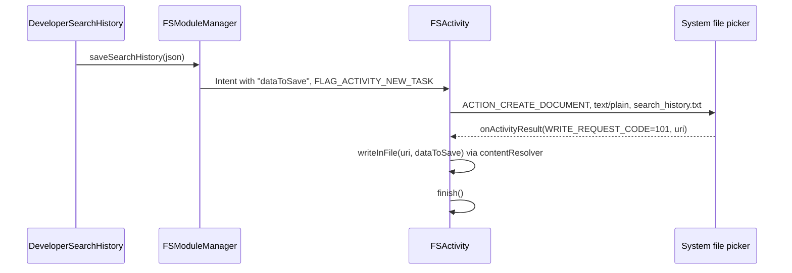
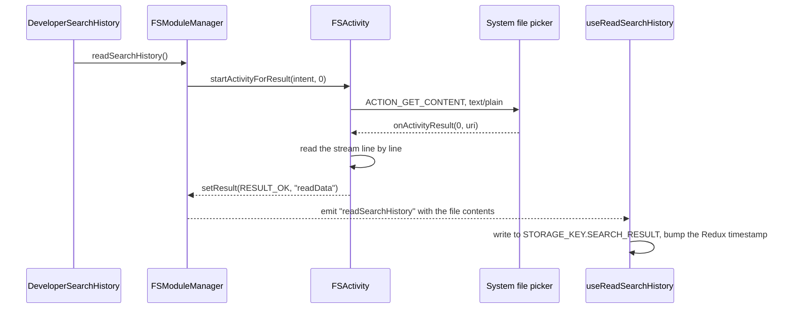

# 08 — Android Native Layer

Everything under `android/`. A single `:app` module with three custom native modules written in Kotlin.

- [Project structure](#project-structure)
- [MainApplication and MainActivity](#mainapplication-and-mainactivity)
- [Native modules](#native-modules)
  - [DBModuleManager](#dbmodulemanager)
  - [FSModuleManager and FSActivity](#fsmodulemanager-and-fsactivity)
  - [RestartModuleManager](#restartmodulemanager)
- [Package registration](#package-registration)
- [AndroidManifest](#androidmanifest)
- [Gradle configuration](#gradle-configuration)
- [Signing](#signing)
- [Adding a new native module](#adding-a-new-native-module)
- [Known issues](#known-issues)

---

## Project structure

```
android/
  build.gradle                  SDK versions, Kotlin 1.8.10, plugin classpaths
  settings.gradle               :app + the RN Gradle plugin included build
  gradle.properties             Hermes on, New Architecture off, Jetifier on
  gradle/wrapper/               Gradle 8.3
  local.properties              local SDK path (machine-specific, gitignored in spirit)
  app/
    build.gradle                app module config, signing, version
    debug.keystore              ALSO used for release builds
    google-services.json        Firebase config
    proguard-rules.pro          empty (minification is off)
    src/debug/AndroidManifest.xml
    src/main/
      AndroidManifest.xml
      java/com/wyrazowo/
        MainApplication.kt
        MainActivity.kt
        DBModuleManager.kt      / DBModulePackage.kt
        FSModuleManager.kt      / FSModulePackage.kt      / FSActivity.kt
        RestartModuleManager.kt / RestartModulePackage.kt
      res/
        mipmap-*/               launcher icons
        values/strings.xml      app_name = Wyrazowo
        values/styles.xml       AppTheme
        drawable/
```

Nine Kotlin files total. There is no `androidTest` or `test` source set.

**There is no word-database asset in the APK.** The corpus lives in the JS bundle and is passed to
`DBModule` on every call.

---

## MainApplication and MainActivity

```13:46:android/app/src/main/java/com/wyrazowo/MainApplication.kt
class MainApplication : Application(), ReactApplication {
    override val reactNativeHost: ReactNativeHost = object : DefaultReactNativeHost(this) {
        override fun getUseDeveloperSupport(): Boolean {
            return BuildConfig.DEBUG
        }

        override fun getPackages(): List<ReactPackage> {
            val packages: MutableList<ReactPackage> = PackageList(this).packages
            packages.add(DBModulePackage())
            packages.add(FSModulePackage())
            packages.add(RestartModulePackage())
            return packages
        }
```

The only customization over the RN template is the three `packages.add(...)` lines.

```37:45:android/app/src/main/java/com/wyrazowo/MainApplication.kt
    override fun onCreate() {
        super.onCreate()
        SoLoader.init(this,  /* native exopackage */false)
        if (BuildConfig.IS_NEW_ARCHITECTURE_ENABLED) {
            // If you opted-in for the New Architecture, we load the native entry point for this app.
            load()
        }
        ReactNativeFlipper.initializeFlipper(this, reactNativeHost.reactInstanceManager)
    }
```

> **Flipper is initialized unconditionally**, in release builds too. The RN template guards this with
> `if (BuildConfig.DEBUG)`. It ships a debugging tool into production builds; unlike iOS (where Flipper
> is disabled in the Podfile), Android has it always on.

`MainActivity` is minimal:

```10:26:android/app/src/main/java/com/wyrazowo/MainActivity.kt
class MainActivity : ReactActivity() {
    override fun getMainComponentName(): String? {
        return "Wyrazowo"
    }

    override fun onCreate(savedInstanceState: Bundle?) {
        super.onCreate(null)
    }
```

`super.onCreate(null)` is the standard `react-native-screens` workaround: it discards saved instance
state so Android does not try to restore a fragment hierarchy React Native no longer owns.

The component name `"Wyrazowo"` must match `app.json` and `AppRegistry.registerComponent`.

---

## Native modules

All three extend `ReactContextBaseJavaModule` and expose methods with `@ReactMethod`. None override
`getConstants()` or use promises — everything is either fire-and-forget or event-based.

| Class | JS name | Methods |
| --- | --- | --- |
| `DBModuleManager` | `NativeModules.DBModule` | `findPossibleWords` |
| `FSModuleManager` | `NativeModules.FSModule` | `saveSearchHistory`, `readSearchHistory` |
| `RestartModuleManager` | `NativeModules.RestartModule` | `restartApp` |

There is no equivalent of iOS's `EventEmitter` module — Android emits directly through
`RCTDeviceEventEmitter`.

---

### DBModuleManager

**File:** `android/app/src/main/java/com/wyrazowo/DBModuleManager.kt` (143 lines)

The Android implementation of the word matcher. The algorithm is documented in
[`02-search-engine.md`](02-search-engine.md#the-matching-algorithm).

#### Signature and parsing

```21:35:android/app/src/main/java/com/wyrazowo/DBModuleManager.kt
    @ReactMethod
    fun findPossibleWords(
        allWords: String,
        selectedLetters: String,
        wordToExtend: String?,
    ): Any {
        val LETTER_SOAP = "?"
        val LETTER_SOAP_PLACEHOLDER = "*"
        val LETTER_INDEX_SEPARATOR = "!"

        val gson = GsonBuilder().create()

        val words = gson.fromJson<ArrayList<String>>(allWords, object :TypeToken<ArrayList<String>>(){}.type).toMutableList()
        val selectedLetters = gson.fromJson<ArrayList<String>>(selectedLetters, object :TypeToken<ArrayList<String>>(){}.type).toMutableList()
```

Gson deserializes both JSON string arguments. This is where the memory spike happens: a full 2–15
letter search materializes ~3.2 million Kotlin `String` objects, on top of the JSON string that was
already copied across the bridge.

Note the shadowing — the local `selectedLetters` shadows the parameter of the same name, which is
legal but confusing.

#### Result delivery

```137:141:android/app/src/main/java/com/wyrazowo/DBModuleManager.kt
        reactApplicationContext
            .getJSModule(RCTDeviceEventEmitter::class.java)
            .emit("findPossibleWordsResult", gson.toJson(filterWords))

        return true
```

**The payload is a JSON string**, unlike iOS which sends a native array. That is why
`useNativeDBEvents` calls `JSON.parse` on Android and not on iOS.

#### The dead progress event

```15:19:android/app/src/main/java/com/wyrazowo/DBModuleManager.kt
    private fun sendProgressEvent(progress: Int) {
        reactApplicationContext
            .getJSModule(RCTDeviceEventEmitter::class.java)
            .emit("searchEngineProgress", progress)
    }
```

`sendProgressEvent` is **never called**, and nothing in JS listens for `searchEngineProgress`. It is
the remains of an abandoned progress-bar feature. Worth keeping in mind if you add progress reporting
— the plumbing is half-built.

#### Threading

Without a `getName()`-level thread override or coroutine dispatch, `@ReactMethod` calls run on the
**native modules thread**. The UI thread is not directly blocked (better than iOS), but the bridge is,
so no other native call can proceed until the search finishes.

#### Kotlin-specific quirks

```52:52:android/app/src/main/java/com/wyrazowo/DBModuleManager.kt
                .filter { letter -> letter !== LETTER_SOAP && !letter.contains(LETTER_SOAP_PLACEHOLDER) }
```

`!==` is Kotlin **referential** inequality, not structural. It happens to work here because the
compared strings come from different sources and are never the same instance, but `!=` is what was
meant. The same pattern appears at lines 58, 75, 86, 87 and 121 (`===` on `Int` works because of
autoboxing caches for small values, which is fragile reasoning).

```69:69:android/app/src/main/java/com/wyrazowo/DBModuleManager.kt
                    if (forcedIndexLetter!!.split(LETTER_INDEX_SEPARATOR)[0] == char) {
```

A non-null assertion that will throw if the lookup fails. Likewise `.toInt()` on the index part will
throw on malformed input like `"A!"`.

Also note `word.map { it.uppercase() }` produces a `List<String>`, so `char` in the loop is a
single-character `String`, not a `Char` — which is why comparisons against `String` values work.

---

### FSModuleManager and FSActivity

Search history export and import through the **Storage Access Framework**. Unlike iOS, the user picks
the file.

```33:46:android/app/src/main/java/com/wyrazowo/FSModuleManager.kt
    @ReactMethod
    fun saveSearchHistory(searchHistory: String) {
      val createFileIntent = Intent(reactApplicationContext, FSActivity::class.java)
      createFileIntent.putExtra("dataToSave", searchHistory)
      createFileIntent.flags = Intent.FLAG_ACTIVITY_NEW_TASK
      reactApplicationContext.startActivity(createFileIntent)
    }

    @ReactMethod
    fun readSearchHistory() {
      val readFileIntent = Intent(reactApplicationContext, FSActivity::class.java)
      readFileIntent.flags = Intent.FLAG_ACTIVITY_MULTIPLE_TASK
      reactApplicationContext.startActivityForResult(readFileIntent, 0, Bundle.EMPTY)
    }
```

`FSActivity` is a **headless activity**: it has no layout, and decides what to do based on whether the
`dataToSave` extra is present.

```18:34:android/app/src/main/java/com/wyrazowo/FSActivity.kt
  override fun onCreate(savedInstanceState: Bundle?) {
    super.onCreate(savedInstanceState)
    val intent = intent
    dataToSave = intent.getStringExtra("dataToSave")

    if (dataToSave != null) {
      val createIntent = Intent(Intent.ACTION_CREATE_DOCUMENT)
      createIntent.addCategory(Intent.CATEGORY_OPENABLE)
      createIntent.type = "text/plain"
      createIntent.putExtra(Intent.EXTRA_TITLE, "search_history" + ".txt")
      startActivityForResult(createIntent, WRITE_REQUEST_CODE)
    } else {
      val readIntent = Intent(Intent.ACTION_GET_CONTENT)
      readIntent.type = "text/plain"
      startActivityForResult(readIntent, 0)
    }
  }
```

#### Export flow



#### Import flow



The bridge back into JS is a `BaseActivityEventListener` registered in the module's `init`:

```16:31:android/app/src/main/java/com/wyrazowo/FSModuleManager.kt
    private val listener: BaseActivityEventListener = object : BaseActivityEventListener() {
      override fun onActivityResult(activity: Activity, requestCode: Int, resultCode: Int, data: Intent?) {
        super.onActivityResult(activity, requestCode, resultCode, data)
        if (requestCode == 0) {
          if (resultCode == Activity.RESULT_OK) {
            reactApplicationContext
              .getJSModule(DeviceEventManagerModule.RCTDeviceEventEmitter::class.java)
              .emit("readSearchHistory", data!!.getStringExtra("readData"))
          }
        }
      }
    }
```

Things to know before touching this:

- `startActivityForResult` and `onActivityResult` are **deprecated**. The modern replacement is the
  Activity Result API (`registerForActivityResult` with `ActivityResultContracts.CreateDocument` /
  `GetContent`).
- `ACTION_GET_CONTENT` gives temporary access; `ACTION_OPEN_DOCUMENT` would be the more appropriate
  SAF intent for reading a user file.
- The reader appends lines **without newlines**, so multi-line files are concatenated. Fine for the
  single-line JSON the app writes, but it will corrupt anything else.
- The `WRITE_EXTERNAL_STORAGE` / `READ_EXTERNAL_STORAGE` permissions in the manifest are **not needed**
  — SAF works without them, and they are ignored on API 29+ anyway.

---

### RestartModuleManager

```10:24:android/app/src/main/java/com/wyrazowo/RestartModuleManager.kt
class RestartModuleManager(reactContext: ReactApplicationContext): ReactContextBaseJavaModule(reactContext) {
    override fun getName(): String {
        return "RestartModule"
    }

    @ReactMethod
    fun restartApp(): Boolean {
        val packageManager: PackageManager = reactApplicationContext.getPackageManager()
        val intent = packageManager.getLaunchIntentForPackage(reactApplicationContext.getPackageName())
        val componentName = intent!!.component
        val mainIntent = Intent.makeRestartActivityTask(componentName)
        reactApplicationContext.startActivity(mainIntent)
        Runtime.getRuntime().exit(0)
        return true
    }
}
```

The Android restart is more legitimate than the iOS one: `Intent.makeRestartActivityTask` is the
documented way to relaunch, and `exit(0)` afterwards kills the old process. Called only after a
language change.

---

## Package registration

Each module has a boilerplate `ReactPackage`:

```11:22:android/app/src/main/java/com/wyrazowo/DBModulePackage.kt
class DBModulePackage(): ReactPackage {
    override fun createNativeModules(reactContext: ReactApplicationContext): MutableList<NativeModule> {
        val modules = ArrayList<NativeModule>()
        modules.add(DBModuleManager(reactContext))
        return modules
    }

    override fun createViewManagers(reactContext: ReactApplicationContext): MutableList<ViewManager<View, ReactShadowNode<*>>> {
        return Collections.emptyList()
    }
}
```

`FSModulePackage` and `RestartModulePackage` are identical apart from the class they instantiate. All
three are added in `MainApplication.getPackages()`. Third-party libraries are picked up by autolinking
via `PackageList(this).packages`.

---

## AndroidManifest

```xml
<uses-permission android:name="android.permission.INTERNET" />
<uses-permission android:name="android.permission.WRITE_EXTERNAL_STORAGE"/>
<uses-permission android:name="android.permission.READ_EXTERNAL_STORAGE"/>
```

| Permission | Needed? |
| --- | --- |
| `INTERNET` | Yes — Firebase, sjp.pl, the WebView |
| `WRITE_EXTERNAL_STORAGE` | No — SAF does not require it |
| `READ_EXTERNAL_STORAGE` | No — same |

Application attributes: `android:allowBackup="false"`, `android:theme="@style/AppTheme"`, launcher and
round launcher icons from `mipmap`.

### Activities

| Activity | Attributes |
| --- | --- |
| `.MainActivity` | `exported="true"`, `launchMode="singleTask"`, `screenOrientation="portrait"`, `windowSoftInputMode="adjustResize"`, `configChanges` for keyboard/orientation/UI mode, LAUNCHER intent filter |
| `.FSActivity` | only `label` and `name` |

> **`FSActivity` has no `android:exported` attribute.** On Android 12+ (API 31) every activity must
> declare it explicitly. Because `FSActivity` has no intent filter, the implicit default is `false`,
> so the build currently succeeds — but this is the kind of thing that breaks on an AGP upgrade, and
> it is worth adding `android:exported="false"` explicitly. `FSActivity` also has no theme, so it
> flashes the default window background while the file picker opens.

### Debug overlay

`src/debug/AndroidManifest.xml` adds `android:usesCleartextTraffic="true"` for Metro, plus the storage
permissions again. Debug-only.

---

## Gradle configuration

### Root `build.gradle`

| Property | Value |
| --- | --- |
| `minSdkVersion` | 21 (Android 5.0) |
| `compileSdkVersion` | 34 |
| `targetSdkVersion` | 34 |
| `buildToolsVersion` | 34.0.0 |
| `ndkVersion` | 25.1.8937393 |
| `kotlinVersion` | 1.8.10 |
| `googlePlayServicesAuthVersion` | 19.2.0 |
| `RNNKotlinVersion` | 1.4.31 (declared, unused) |

Plugin classpaths: Kotlin Gradle plugin, Android Gradle plugin (unpinned version), the React Native
Gradle plugin, `kotlin-serialization`, and `com.google.gms:google-services:4.3.15`.

Gradle wrapper: **8.3**.

### `app/build.gradle`

Plugins applied: `com.android.application`, `com.google.gms.google-services`, `com.facebook.react`,
`kotlin-android`, `kotlinx-serialization`.

| Setting | Value |
| --- | --- |
| `namespace` / `applicationId` | `com.wyrazowo` |
| `versionCode` | `100221` |
| `versionName` | `1.22.1` |
| ABI splits | disabled (`enableSeparateBuildPerCPUArchitecture = false`) |
| ProGuard in release | disabled (`enableProguardInReleaseBuilds = false`) |
| Architectures | `armeabi-v7a, arm64-v8a, x86, x86_64` |

Dependencies:

| Dependency | Purpose |
| --- | --- |
| `com.facebook.react:react-android` | React Native |
| `com.facebook.react:hermes-android` | Hermes (JSC fallback configured but unused) |
| `com.facebook.react:flipper-integration` | Flipper |
| `com.google.code.gson:gson:2.8.9` | JSON in `DBModuleManager` |
| `org.jetbrains.kotlinx:kotlinx-serialization-json:1.5.0` | **unused** — Gson is used instead |
| `org.jetbrains.kotlin:kotlin-stdlib-jdk7:1.8.0` | Kotlin stdlib (note: 1.8.0 vs the 1.8.10 plugin) |
| `androidx.swiperefreshlayout:swiperefreshlayout:1.0.0` | RN template default |
| `com.facebook.fresco:animated-gif:2.+` | **animated GIF support** — required by the Help screen |

The `kotlinx-serialization` plugin and dependency can both be removed; nothing imports them.
`com.facebook.fresco:animated-gif:2.+` uses a dynamic version, which makes builds non-reproducible.

### `gradle.properties`

| Property | Value |
| --- | --- |
| `android.useAndroidX` | `true` |
| `android.enableJetifier` | `true` — legacy support-library conversion, slows every build |
| `newArchEnabled` | `false` |
| `hermesEnabled` | `true` |
| `org.gradle.jvmargs` | `-Xmx2048m -XX:MaxMetaspaceSize=512m` |
| `org.gradle.parallel` | commented out |

---

## Signing

```gradle
signingConfigs {
    debug {
        storeFile file('debug.keystore')
        storePassword 'android'
        keyAlias 'androiddebugkey'
        keyPassword 'android'
    }
}
buildTypes {
    release {
        // Caution! In production, you need to generate your own keystore file.
        signingConfig signingConfigs.debug
```

**The release build type is signed with the debug keystore.** This is the RN template default that
was never replaced — the template's own comment warning about it is still in the file.

Consequences: the APK cannot be uploaded to Google Play, the signing key is public (password
`android`), and anyone can produce a build that the OS treats as an update to this app. A real
keystore plus a `release` signing config is a prerequisite for any Play Store release.

---

## Adding a new native module

Three files, following the existing pattern:

1. **The module**, `MyModuleManager.kt`:
   ```kotlin
   class MyModuleManager(reactContext: ReactApplicationContext): ReactContextBaseJavaModule(reactContext) {
       override fun getName(): String = "MyModule"

       @ReactMethod
       fun doSomething(argument: String): Boolean {
           return true
       }
   }
   ```
2. **The package**, `MyModulePackage.kt` — copy `DBModulePackage.kt` and swap the class.
3. **Register it** in `MainApplication.getPackages()`:
   ```kotlin
   packages.add(MyModulePackage())
   ```

To emit an event:

```kotlin
reactApplicationContext
    .getJSModule(RCTDeviceEventEmitter::class.java)
    .emit("myEvent", payload)
```

Remember that Android emits through `RCTDeviceEventEmitter` while iOS goes through the `EventEmitter`
module, so JS subscription code must branch on `Platform.OS` — see
`src/native-db/hooks/use-native-sb-events.hook.ts`.

---

## Known issues

| Issue | Severity | Detail |
| --- | --- | --- |
| Release signed with `debug.keystore` | Critical | Cannot ship to Play; public signing key |
| Flipper initialized in release builds | High | Debug tooling in production |
| Whole corpus over the bridge per search | High | ~3.2M strings materialized by Gson per search |
| Search blocks the native modules thread | High | No coroutines, no cancellation, no progress |
| `FSActivity` missing `android:exported` | Medium | Required declaration on API 31+; will break on an AGP upgrade |
| Deprecated `startActivityForResult` | Medium | Should use the Activity Result API |
| Unnecessary storage permissions | Medium | SAF does not need them |
| `!==` / `===` on strings and ints | Medium | Referential comparison where structural was intended |
| Non-null assertions in `DBModuleManager` | Medium | Malformed input crashes |
| `android.enableJetifier=true` | Low | Legacy, slows builds |
| Unused `kotlinx-serialization` | Low | Plugin + dependency can be removed |
| Dynamic version `fresco:animated-gif:2.+` | Low | Non-reproducible builds |
| Dead `sendProgressEvent` | Low | Never called |
| Kotlin stdlib 1.8.0 vs plugin 1.8.10 | Low | Version mismatch |
| No tests | Low | No `test` or `androidTest` source set |

Prioritized alongside the rest of the backlog in
[`11-tech-debt-and-modernization.md`](11-tech-debt-and-modernization.md).
