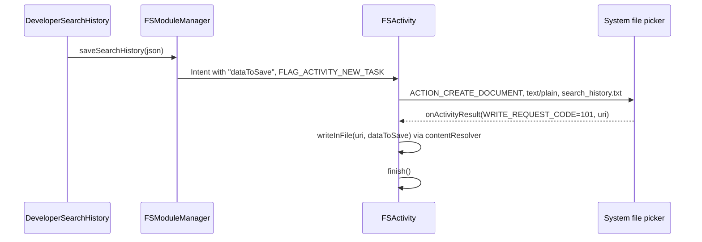
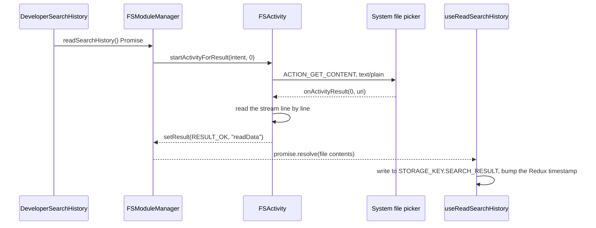

# 08 — Android Native Layer

Everything under `android/`. A single `:app` module with three custom native modules written in Kotlin.

- [Project structure](#project-structure)
- [MainApplication and MainActivity](#mainapplication-and-mainactivity)
- [Native modules](#native-modules)
  - [DBModuleManager](#dbmodulemanager)
  - [FSModuleManager and FSActivity](#fsmodulemanager-and-fsactivity)
  - [RestartModuleManager](#restartmodulemanager)
- [Package registration](#package-registration)
- [AndroidManifest](#androidmanifest)
- [Gradle configuration](#gradle-configuration)
- [Signing](#signing)
- [Adding a new native module](#adding-a-new-native-module)
- [Known issues](#known-issues)

---

## Project structure

```
android/
  build.gradle                  SDK 36, Kotlin 2.1.20, plugin classpaths
  settings.gradle               :app + the RN Gradle plugin included build
  gradle.properties             Hermes on, New Architecture on, Jetifier on
  gradle/wrapper/               Gradle 8.x (RN 0.86 template)
  local.properties              local SDK path (machine-specific)
  app/
    build.gradle                app module config, signing, version
    debug.keystore              ALSO used for release builds
    google-services.json        Firebase config
    proguard-rules.pro          empty (minification is off)
    src/main/
      AndroidManifest.xml
      java/com/wyrazowo/
        MainApplication.kt
        MainActivity.kt
        DBModuleManager.kt      / DBModulePackage.kt
        FSModuleManager.kt      / FSModulePackage.kt      / FSActivity.kt
        RestartModuleManager.kt / RestartModulePackage.kt
      res/
        mipmap-*/               launcher icons
        values/strings.xml      app_name = Wyrazowo
        values/styles.xml       AppTheme
        drawable/
```

Nine Kotlin files total. There is no `androidTest` or `test` source set. The debug-only
`AndroidManifest.xml` overlay was removed — cleartext for Metro is controlled via Gradle manifest
placeholders.

**There is no word-database asset in the APK.** The corpus lives in the JS bundle and is passed to
`DBModule` on every call.

---

## MainApplication and MainActivity

```10:27:android/app/src/main/java/com/wyrazowo/MainApplication.kt
class MainApplication : Application(), ReactApplication {

  override val reactHost: ReactHost by lazy {
    getDefaultReactHost(
      context = applicationContext,
      packageList =
        PackageList(this).packages.apply {
          add(DBModulePackage())
          add(FSModulePackage())
          add(RestartModulePackage())
        },
    )
  }

  override fun onCreate() {
    super.onCreate()
    loadReactNative(this)
  }
}
```

The RN 0.86 template uses `ReactHost` / `loadReactNative` instead of the old `ReactNativeHost` +
`SoLoader` + Flipper bootstrap. **Flipper was removed entirely** — no debug tooling in release builds.

`MainActivity` is minimal:

```10:26:android/app/src/main/java/com/wyrazowo/MainActivity.kt
class MainActivity : ReactActivity() {
    override fun getMainComponentName(): String? {
        return "Wyrazowo"
    }

    override fun onCreate(savedInstanceState: Bundle?) {
        super.onCreate(null)
    }
```

`super.onCreate(null)` is the standard `react-native-screens` workaround: it discards saved instance
state so Android does not try to restore a fragment hierarchy React Native no longer owns.

The component name `"Wyrazowo"` must match `app.json` and `AppRegistry.registerComponent`.

---

## Native modules

All three extend `ReactContextBaseJavaModule` and expose `@ReactMethod` methods that resolve **Promises**
(`com.facebook.react.bridge.Promise`). There is no event-based result delivery for search or file I/O.

| Class | JS name | Methods |
| --- | --- | --- |
| `DBModuleManager` | `NativeModules.DBModule` | `findPossibleWords` → `Promise<string[]>` |
| `FSModuleManager` | `NativeModules.FSModule` | `saveSearchHistory`, `readSearchHistory` → Promises |
| `RestartModuleManager` | `NativeModules.RestartModule` | `restartApp` |

---

### DBModuleManager

**File:** `android/app/src/main/java/com/wyrazowo/DBModuleManager.kt` (143 lines)

The Android implementation of the word matcher. The algorithm is documented in
[`02-search-engine.md`](02-search-engine.md#the-matching-algorithm).

#### Signature and parsing

```21:35:android/app/src/main/java/com/wyrazowo/DBModuleManager.kt
    @ReactMethod
    fun findPossibleWords(
        allWords: String,
        selectedLetters: String,
        wordToExtend: String?,
    ): Any {
        val LETTER_SOAP = "?"
        val LETTER_SOAP_PLACEHOLDER = "*"
        val LETTER_INDEX_SEPARATOR = "!"

        val gson = GsonBuilder().create()

        val words = gson.fromJson<ArrayList<String>>(allWords, object :TypeToken<ArrayList<String>>(){}.type).toMutableList()
        val selectedLetters = gson.fromJson<ArrayList<String>>(selectedLetters, object :TypeToken<ArrayList<String>>(){}.type).toMutableList()
```

Gson deserializes both JSON string arguments. This is where the memory spike happens: a full 2–15
letter search materializes ~3.2 million Kotlin `String` objects, on top of the JSON string that was
already copied across the bridge.

Note the shadowing — the local `selectedLetters` shadows the parameter of the same name, which is
legal but confusing.

#### Result delivery

When matching completes, `promise.resolve(WritableNativeArray)` is called with the filtered words.
JS receives a `string[]` on the Promise — no `DeviceEventEmitter` subscription and no JSON parse step.

#### Threading

Without a `getName()`-level thread override or coroutine dispatch, `@ReactMethod` calls run on the
**native modules thread**. The UI thread is not directly blocked (better than iOS), but the bridge is,
so no other native call can proceed until the search finishes.

#### Kotlin-specific quirks

```52:52:android/app/src/main/java/com/wyrazowo/DBModuleManager.kt
                .filter { letter -> letter !== LETTER_SOAP && !letter.contains(LETTER_SOAP_PLACEHOLDER) }
```

`!==` is Kotlin **referential** inequality, not structural. It happens to work here because the
compared strings come from different sources and are never the same instance, but `!=` is what was
meant. The same pattern appears at lines 58, 75, 86, 87 and 121 (`===` on `Int` works because of
autoboxing caches for small values, which is fragile reasoning).

```69:69:android/app/src/main/java/com/wyrazowo/DBModuleManager.kt
                    if (forcedIndexLetter!!.split(LETTER_INDEX_SEPARATOR)[0] == char) {
```

A non-null assertion that will throw if the lookup fails. Likewise `.toInt()` on the index part will
throw on malformed input like `"A!"`.

Also note `word.map { it.uppercase() }` produces a `List<String>`, so `char` in the loop is a
single-character `String`, not a `Char` — which is why comparisons against `String` values work.

---

### FSModuleManager and FSActivity

Search history export and import through the **Storage Access Framework**. Unlike iOS, the user picks
the file.

```33:46:android/app/src/main/java/com/wyrazowo/FSModuleManager.kt
    @ReactMethod
    fun saveSearchHistory(searchHistory: String) {
      val createFileIntent = Intent(reactApplicationContext, FSActivity::class.java)
      createFileIntent.putExtra("dataToSave", searchHistory)
      createFileIntent.flags = Intent.FLAG_ACTIVITY_NEW_TASK
      reactApplicationContext.startActivity(createFileIntent)
    }

    @ReactMethod
    fun readSearchHistory() {
      val readFileIntent = Intent(reactApplicationContext, FSActivity::class.java)
      readFileIntent.flags = Intent.FLAG_ACTIVITY_MULTIPLE_TASK
      reactApplicationContext.startActivityForResult(readFileIntent, 0, Bundle.EMPTY)
    }
```

`FSActivity` is a **headless activity**: it has no layout, and decides what to do based on whether the
`dataToSave` extra is present.

```18:34:android/app/src/main/java/com/wyrazowo/FSActivity.kt
  override fun onCreate(savedInstanceState: Bundle?) {
    super.onCreate(savedInstanceState)
    val intent = intent
    dataToSave = intent.getStringExtra("dataToSave")

    if (dataToSave != null) {
      val createIntent = Intent(Intent.ACTION_CREATE_DOCUMENT)
      createIntent.addCategory(Intent.CATEGORY_OPENABLE)
      createIntent.type = "text/plain"
      createIntent.putExtra(Intent.EXTRA_TITLE, "search_history" + ".txt")
      startActivityForResult(createIntent, WRITE_REQUEST_CODE)
    } else {
      val readIntent = Intent(Intent.ACTION_GET_CONTENT)
      readIntent.type = "text/plain"
      startActivityForResult(readIntent, 0)
    }
  }
```

#### Export flow



#### Import flow



`FSModuleManager` holds a `pendingReadPromise` and resolves it from an `BaseActivityEventListener`
when the SAF picker returns — the bridge to JS is the Promise, not an event emit.

Things to know before touching this:

- `startActivityForResult` and `onActivityResult` are **deprecated**. The modern replacement is the
  Activity Result API (`registerForActivityResult` with `ActivityResultContracts.CreateDocument` /
  `GetContent`).
- `ACTION_GET_CONTENT` gives temporary access; `ACTION_OPEN_DOCUMENT` would be the more appropriate
  SAF intent for reading a user file.
- The reader appends lines **without newlines**, so multi-line files are concatenated. Fine for the
  single-line JSON the app writes, but it will corrupt anything else.

---

### RestartModuleManager

```10:24:android/app/src/main/java/com/wyrazowo/RestartModuleManager.kt
class RestartModuleManager(reactContext: ReactApplicationContext): ReactContextBaseJavaModule(reactContext) {
    override fun getName(): String {
        return "RestartModule"
    }

    @ReactMethod
    fun restartApp(): Boolean {
        val packageManager: PackageManager = reactApplicationContext.getPackageManager()
        val intent = packageManager.getLaunchIntentForPackage(reactApplicationContext.getPackageName())
        val componentName = intent!!.component
        val mainIntent = Intent.makeRestartActivityTask(componentName)
        reactApplicationContext.startActivity(mainIntent)
        Runtime.getRuntime().exit(0)
        return true
    }
}
```

The Android restart is more legitimate than the iOS one: `Intent.makeRestartActivityTask` is the
documented way to relaunch, and `exit(0)` afterwards kills the old process. Called only after a
language change.

---

## Package registration

Each module has a boilerplate `ReactPackage`:

```11:22:android/app/src/main/java/com/wyrazowo/DBModulePackage.kt
class DBModulePackage(): ReactPackage {
    override fun createNativeModules(reactContext: ReactApplicationContext): MutableList<NativeModule> {
        val modules = ArrayList<NativeModule>()
        modules.add(DBModuleManager(reactContext))
        return modules
    }

    override fun createViewManagers(reactContext: ReactApplicationContext): MutableList<ViewManager<View, ReactShadowNode<*>>> {
        return Collections.emptyList()
    }
}
```

`FSModulePackage` and `RestartModulePackage` are identical apart from the class they instantiate. All
three are added in `MainApplication.getPackages()`. Third-party libraries are picked up by autolinking
via `PackageList(this).packages`.

---

## AndroidManifest

```xml
<uses-permission android:name="android.permission.INTERNET" />
```

| Permission | Needed? |
| --- | --- |
| `INTERNET` | Yes — Firebase, sjp.pl, the WebView |

Storage permissions were **removed** in 1.23.0 — SAF does not require them.

Application attributes: `android:allowBackup="false"`, `android:theme="@style/AppTheme"`, launcher and
round launcher icons from `mipmap`.

### Activities

| Activity | Attributes |
| --- | --- |
| `.MainActivity` | `exported="true"`, `launchMode="singleTask"`, `screenOrientation="portrait"`, `windowSoftInputMode="adjustResize"`, `configChanges` for keyboard/orientation/UI mode, LAUNCHER intent filter |
| `.FSActivity` | `android:exported="false"`, `label`, `name` |

`FSActivity` explicitly declares `android:exported="false"` (fixed in 1.23.0). It has no theme, so it
flashes the default window background while the file picker opens.

Cleartext traffic for Metro is enabled via `android:usesCleartextTraffic="${usesCleartextTraffic}"` on
the `<application>` tag (Gradle placeholder, debug builds only).

---

## Gradle configuration

### Root `build.gradle`

| Property | Value |
| --- | --- |
| `minSdkVersion` | 24 |
| `compileSdkVersion` | 36 |
| `targetSdkVersion` | 36 |
| `buildToolsVersion` | 36.0.0 |
| `ndkVersion` | 27.1.12297006 |
| `kotlinVersion` | 2.1.20 |

Plugin classpaths: Kotlin Gradle plugin, Android Gradle plugin (unpinned version), the React Native
Gradle plugin, `kotlin-serialization`, and `com.google.gms:google-services:4.3.15`.

Gradle wrapper: **8.3**.

### `app/build.gradle`

Plugins applied: `com.android.application`, `com.google.gms.google-services`, `com.facebook.react`,
`kotlin-android`.

| Setting | Value |
| --- | --- |
| `namespace` / `applicationId` | `com.wyrazowo` |
| `versionCode` | `100221` (until release script bumps to `100230` for 1.23.0) |
| `versionName` | `1.22.1` |
| ABI splits | disabled |
| ProGuard in release | disabled |
| Architectures | RN 0.86 default ABIs |

Dependencies (high level):

| Dependency | Purpose |
| --- | --- |
| `com.facebook.react:react-android` | React Native |
| `com.facebook.react:hermes-android` | Hermes |
| `com.google.code.gson:gson` | JSON parsing in `DBModuleManager` |
| `com.facebook.fresco:animated-gif` | Help screen GIFs |

### `gradle.properties`

| Property | Value |
| --- | --- |
| `android.useAndroidX` | `true` |
| `android.enableJetifier` | `true` — legacy support-library conversion, slows every build |
| `newArchEnabled` | **`true`** — mandatory for Firebase v26 / Reanimated 4 |
| `hermesEnabled` | `true` |
| `org.gradle.jvmargs` | `-Xmx2048m -XX:MaxMetaspaceSize=512m` |
| `org.gradle.parallel` | commented out |

---

## Signing

```gradle
signingConfigs {
    debug {
        storeFile file('debug.keystore')
        storePassword 'android'
        keyAlias 'androiddebugkey'
        keyPassword 'android'
    }
}
buildTypes {
    release {
        // Caution! In production, you need to generate your own keystore file.
        signingConfig signingConfigs.debug
```

**The release build type is signed with the debug keystore.** This is the RN template default that
was never replaced — the template's own comment warning about it is still in the file.

Consequences: the APK cannot be uploaded to Google Play, the signing key is public (password
`android`), and anyone can produce a build that the OS treats as an update to this app. A real
keystore plus a `release` signing config is a prerequisite for any Play Store release.

---

## Adding a new native module

Three files, following the existing pattern:

1. **The module**, `MyModuleManager.kt`:
   ```kotlin
   class MyModuleManager(reactContext: ReactApplicationContext): ReactContextBaseJavaModule(reactContext) {
       override fun getName(): String = "MyModule"

       @ReactMethod
       fun doSomething(argument: String): Boolean {
           return true
       }
   }
   ```
2. **The package**, `MyModulePackage.kt` — copy `DBModulePackage.kt` and swap the class.
3. **Register it** in `MainApplication` `reactHost` package list (same `PackageList(...).apply { add(...) }` pattern).

For Promise-returning methods, add a `promise: Promise` parameter and call `promise.resolve(...)` /
`promise.reject(...)`.

---

## Known issues

| Issue | Severity | Detail |
| --- | --- | --- |
| Release signed with `debug.keystore` | Critical | Cannot ship to Play; public signing key |
| Whole corpus over the bridge per search | High | ~3.2M strings materialized by Gson per search |
| Search blocks the native modules thread | High | No coroutines, no cancellation, no progress |
| Deprecated `startActivityForResult` | Medium | Should use the Activity Result API |
| `!==` / `===` on strings and ints | Medium | Referential comparison where structural was intended |
| Non-null assertions in `DBModuleManager` | Medium | Malformed input crashes |
| `android.enableJetifier=true` | Low | Legacy, slows builds |
| No tests | Low | No `test` or `androidTest` source set |

Prioritized alongside the rest of the backlog in
[`11-tech-debt-and-modernization.md`](11-tech-debt-and-modernization.md).
